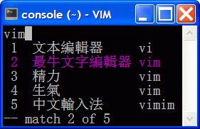

.. header:: VimIM -- Input Method by Vim, of Vim, for Vimmers
            : : : : : : : `中文简体 <vimim.html>`_
            : : : : : : : `中文繁體 <vimim.big5.html>`_
            : : : : : : : `English  <vimim.vim.html>`_
.. footer:: vimim@googlegroups.com at |time| on |date|
            【VimIM ®许可协议：GNU 自由文档许可证 **GFDL** 】
.. |date|   date:: %A, %m/%d/%Y
.. |time|   date:: %H:%M:%S PST
.. ----------------------------------------------------------------
                       maxiangjiang  http://code.google.com/p/vimim
                       x2g3q9g8      http://vimim.googlecode.com
   ---------------------------------------------------------------- v2
                        http://vimim.googlecode.com/files/vimim.vim
                  file:///C:/home/xma/vim/vimfiles/plugin/vimim.vim
   ---------------------------------------------------------------- v3
                     http://maxiangjiang.googlepages.com/vimim.html
                       http://vimim.googlegroups.com/web/vimim.html
                      cp $html ~/www/htdocs/maxiangjiang/vimim.html
             file:///C:/home/xma/www/htdocs/maxiangjiang/vimim.html
   ---------------------------------------------------------------- v4
                 http://maxiangjiang.googlepages.com/vimim.vim.html
         file:///C:/home/xma/www/htdocs/maxiangjiang/vimim.vim.html
   ----------------------------------------------------------------
                              http://code.google.com/p/vimim/w/list
                   file:///C:/home/xma/vim/vimfiles/keymap/phd.wiki
            file:///C:/home/xma/vim/vimfiles/keymap/googlecode.wiki
   ----------------------------------------------------------------
                                 http://zh.wikipedia.org/wiki/VimIM
             file:///C:/home/xma/vim/vimfiles/keymap/wikipedia.wiki
   ----------------------------------------------------------------
                  http://vimim.googlegroups.com/web/vimim.big5.html
        cd ~/www/htdocs/maxiangjiang; cp vimim.html vimim.big5.html
        file:///C:/home/xma/www/htdocs/maxiangjiang/vimim.big5.html
   ----------------------------------------------------------------
     file:///C:/home/xma/www/htdocs/maxiangjiang/vimim_tty_logo.gif
         file:///C:/home/xma/www/htdocs/maxiangjiang/vimim_logo.gif
                 http://maxiangjiang.googlepages.com/vimim_logo.gif
             http://maxiangjiang.googlepages.com/vimim_tty_logo.gif
   ----------------------------------------------------------------
                                       woyouyigeqiguaidemeilidemeng
                      http://maxiangjiang.googlepages.com/dream.png
   ----------------------------------------------------------------
   http://code.google.com/p/ibus/downloads/list
   ============================================ googlecode
   code() { /bin/python ~/script/python/googlecode_upload.py "$@" ;}
   code -s latest_code -p vimim vimim.vim
   --------------------------------------------
           datafile 四角号码输入法词库
   code -s datafile -p vimim vimim.4corner.txt
           datafile 汉语拼音输入法词库
   code -s datafile -p vimim vimim.pinyin.txt
           datafile 英文输入法词库
   code -s datafile -p vimim vimim.english.txt
           datafile 私人信息样本文件
   code -s datafile -p vimim ~/vim/vimfiles/plugin/tmp/privates.txt
           datafile 中文电报码  http://www.dtc.umn.edu/~reedsj/ctc.html
   code -s datafile -p vimim ~/vim/vimfiles/plugin/tmp/vimim.ctc.txt
   --------------------------------------------
   code -s datafile -p vimim vimim.cns11643.txt
   code -s datafile -p vimim vimim.wubi.txt
   code -s datafile -p vimim vimim.phonetic.txt
   code -s datafile -p vimim vimim.array30.txt
   code -s datafile -p vimim vimim.quick.txt
   code -s datafile -p vimim vimim.nature.txt
   code -s datafile -p vimim vimim.cangjie.txt
   code -s datafile -p vimim vimim.xinhua.txt
   code -s datafile -p vimim vimim.wubi98.txt
   code -s datafile -p vimim vimim.wubijd.txt
   code -s datafile -p vimim vimim.pinyin_huge.txt
   code -s datafile -p vimim vimim.12345.txt
   code -s datafile -p vimim vimim.hangul.txt
   code -s datafile -p vimim vimim.erbi.txt
   code -s datafile -p vimim vimim.pinyin_canton.txt
   code -s datafile -p vimim vimim.zhengma.txt
   code -s datafile -p vimim vimim.pinyin_hongkong.txt
   code -s datafile -p vimim vimim.wu.txt
   code -s datafile -p vimim vimim.yong.txt
   code -s datafile -p vimim vimim.pinyin_fcitx.txt
   ------------------------------------------------------------- ciku
   sougou_FCITX http://code.google.com/p/sg2fcitx/downloads/list
   ----------------------------------------------------------------
   vim 常被称作“程序员的编辑器”，其功能如此强大以致许多人认为它就
   是个完整的IDE。当然，它并不仅仅为程序员而生。对于各种文本编辑而言，
   无论是撰写email还是编辑配置文件，Vim都臻于完美。
   ----------------------------------------------------------------
   VimIM 是一个专门为 vim 玩家开发的嵌入式输入法，只要你的 vim 可以
   显示中文，就可以用 VimIM。便捷的快捷键和独特的输入模式，完美的解
   决了 vim 的中文切换问题。
   ----------------------------------------------------------------

=========================
VimIM —— Vim 中文输入法
=========================

.. :作者: vimim
.. :电子邮箱: vimim@googlegroups.com
.. sidebar:: 目录

   .. contents:: :local:

.. figure:: vimim_logo.gif
   :alt: VimIM —— Vim 中文输入法 logo

   —— 子曰：“工欲善其事，必先利其器。”

|
| VimIM 是专为 vim 玩家开发的插件，可作为 vim 内嵌中文输入法。
| 只要您的 vim 能显示中文，您就能用 vim 输入搜索中文。
| VimIM 把 vim 的中文编辑潜能，提升到一个全新的高度。
|

:官方网址:  http://vim.sf.net/scripts/script.php?script_id=2506
:新闻论坛:  http://groups.google.com/group/vimim
:词库下载:  http://code.google.com/p/vimim/downloads/list
:最新主页:  http://maxiangjiang.googlepages.com/vimim.html

|

|

概述
====
| 一个文本文件，构成一个中文输入法。插上联网就可以云输入。
| 如果再加上一个文本文件，无需联网照样敲打中文，随心所欲。
|
| 程式文件用的是 vim script, 天生跨平台（Windows, Mac, Linux）
| 词库文件就是自己的输入法（全拼或双拼，五笔，英文，DIY）
|
| 所谓安装，就是把文本文件扔到 vim 的 plugin 目录之下。
|
| 不加设置，不换模式，点热键就可上汉字，是谓〖点石成金〗。
| 如果切换成中文输入模式，也可以将就当前流行的输入法习惯。
|
| 所谓卸载，就是删除文本文件。
|
|

特点
====
* 【独立】 **Plug & Play** 　不折腾　　 **Open Source** 　不差钱　
* 【自主】 整个 vim 连同 VimIM 中文输入法可装入优盘随身携带
* 【自力】 `〖点石成金〗`_ 　　　  VimIM `中文搜索`_
* 【更生】 `〖中文输入模式〗`_  　 VimIM `山寨双码输入`_
* 【高性能】个性　智能　自然　流畅
* 【低能耗】小巧　玲珑　无捆绑　无干扰
* 【和谐☆绿色】 No secret hidden glitch; No strings attached.
* 【自由☆免费】 Free as in freedom, as well as in `free beer!`__

__ `VimIM 基金会`_

|

复活节彩蛋
==========
(1) 确认您的 vim 能显示中文： `［科普］如何让Vim支持中文？`_
(2) 首先去 `VimIM 官方网址
    <http://vim.sourceforge.net/scripts/script.php?script_id=2506>`_
    下载新版脚本
(3) 然后把 vimim.vim 扔到您的 vim 的 plugin 目录之下
(4) 在 『vim 插入模式』 下敲入四键： `vim<C-\\> <vimim_logo.gif>`_

  ====  ==============
  vim<C-\\>
  ====================
   1     文本編輯器
   2     最牛文本編輯器
   3     精力
   4     生氣
   5     中文輸入法
  ====  ==============

【自己动手试一试】

　【目的】VimIM 牛刀小试

　【操作步骤】

  #. 下载新版脚本 vimim.vim
  #. 把脚本扔到您的 vim 的 plugin 目录之下
  #. 打开 vim （如果用Windows可以双击GVim.exe）
  #. 敲 o 或 i 或 a 进入 vim 插入模式：
  #. 敲 v
  #. 敲 i
  #. 敲 m
  #. 敲 <C-\\>
  #. 【结果】 `VimIM logo <vimim_logo.gif>`_

.. sidebar::  VimIM `玩家评论`_ 　Testimonials

  * 众里寻她千百度
  * 最完美的 vim 中文方案
  *  vim + IM == 才子配佳人
  * `vim → 历久弥新`__ 　VimIM → 锦上添花！
  * 这是我见过的最帅的插件__
  * 神插件__
  * `太有创意了 ... 果然闻所未闻 ...`__
  * `彻底终结了中文输入法转换的梦魇`__
  * `因vimim而更喜欢vim了！`__
  * `我感动得都快要哭了`__
  * `居然可以这样，所有的输入法可以去死了。`__

__ http://edt1023.sayya.org/vim/node1.html
__ http://www.douban.com/group/topic/5212341/
__ http://forum.ubuntu.org.cn/viewtopic.php?f=68&p=1135330
__ http://bbs.njupt.edu.cn/cgi-bin/bbstcon?board=Unix&file=M.1235391571.A
__ http://groups.google.com/group/vimim/browse_thread/thread/933ca7066b6fcecd
__ http://cookinglinux.cn/emacs-learning-three-step.html#comment-205
__ http://jouevemau.blogspot.com/2009/04/vim.html
__ http://bbs.chinaunix.net/archiver/tid-1559430-page-7.html

.. http://www.ipedia.org.cn/ip/VimIM
.. http://hyperrate.com/thread.php?tid=9435
   好東西 ... 蠻讚的 ... （台湾）
.. http://cookinglinux.cn/emacs-learning-three-step.html
   我收回vi中输入中文的问题…因为vimim横空出世…
.. http://twitter.com/cbkid/status/1580793545
   vim+vimim哈哈无敌了
.. http://twitter.com/cbkid/status/1580042288
   vimim让vim和中文输入无缝。无敌的插件，终于可以在vim下输入中文了
.. http://twitter.com/ggarlic/status/1417547049
   被vimim深深的震撼了
.. http://friendfeed.com/search?q=vimim
   中文vim用户如果不用这个真是没有天理，你不知道有多好用，
   以后再也不用切换输入法了。可以拿掉输入法了。- xiawinter
.. http://www.douban.com/group/topic/5212341/
   【轻松一笑】 【公告】VimIM 基金会成立维稳办
   这是五一我给自己找到最好的礼物
   如果能在所有文本框调用vim那么电脑没有中文输入法也能混了
.. 最后还是十分感谢作者写出了这么棒的插件，
   使我们这些vim新手更愿意深入学习和使用vim了。
.. http://www.linuxsir.org/bbs/showthread.php?p=1985825#post1985825
   终端中文显示与vim中文输入终于好了。
.. http://groups.google.com/group/xiyoulinux  西邮Linux兴趣小组
   vimim -- 刚见到这个软件时让我目瞪口呆，真是太有创意了，居然利用
   vim的补全功能做了个中文输入法! 可以利用这个小工具在vim中输入中文，
   配合着fbterm 真是太舒服了。码表有很多选择，vi fans 们不可错过。
   vimim的确太强悍了，几个月前看到时我跟楼主一个感觉的，而且可以当辞典用
.. http://bbs.gucas.ac.cn/pc/pccon.php?id=126&nid=31404&s=all
   再无所求 vimim && fireinput  一个浏览器输入，一个vim输入，
   我的生活不就是这两个需要输入中文的地方么？够了
.. http://blog.solrex.cn/articles/vimim.html
   一款非常 cool 的 vim 输入法
.. http://groups.google.com/group/pongba/msg/a53afab1e8b29fa0
   用vimim不会对vim编辑中文文档感到痛苦了；
   我甚至不需要进入X就可以用它来编辑文档了，相当好用，赶快去试试吧
.. http://www.bluedeep.cn/post/89/
   自己也体验了一把，发现原来新版本的VimIM是如此的出色，故转了过来。
   新增了好多很棒也是很必要的功能。成功的超载了其他的外挂输入法。
.. http://goooguo.yo2.cn/articles/vimim%E7%BB%99%E6%88%91%E9%80%81%E6%9D%A5%E4%BA%86%E5%8F%8A%E6%97%B6%E9%9B%A8.html
   Vimim及时雨 ... 今天才突然发现，现在的效果已经比较能够接受了。
.. http://logs.ubuntu-eu.org/free/2009/06/08/%23ubuntu-tw.html
   用vim的福音来了，在vim中因频繁切换输入法而苦恼的人，现在终于可以解脱了
.. http://bbs.ctex.org/viewthread.php?tid=50002
   我这几天天天对着 VimIm 的代码，慢慢都学了一点点了
.. http://sunday.is-programmer.com/posts/9929.html
   我发现 Vim 和 FireFox 是一对天仙配。
   一个以写 (write/update/delete/insert) 为业。
   一个以读 (read/browse/internet/gmail) 为主。
   男耕女织。男欢女爱。
.. http://linux.chinaunix.net/bbs/viewthread.php?tid=1073521
   想在console下使用中文输入法，去装个vimim是最好不过的了。相当强大。
.. http://chunzi.me/post/tag/vimim
   记得有个 vimim 插件的，于是拿来试试，结果喜出望外。
.. http://logs.ubuntu-eu.org/free/2009/06/08/%23ubuntu-tw.html
   用vim的福音来了，vimim是一种vim外挂插件，
   在vim中因频繁切换输入法而苦恼的人，现在终于可以解脱了
.. http://logs.ubuntu-eu.org/free/2009/06/09/%23ubuntu-tw.html
   我這兩天試了下vimim，真爽不得了，讓我輕鬆許多，再也不煩了。
   為了同時支持拼音及五筆，我把這兩個碼表合並在一起，就成了一個雙用的輸入法。
.. http://blog.sina.com.cn/s/blog_5787e4f30100fh34.html
   最近学习了vimim这个中国小伙做的vim神奇插件，不带外面的输入法，
   就能输入汉字。我下载一试，果然行，其实可以输入任何字符。韩字也可以。
.. http://twitter.com/cirEric/status/3191615510
   推荐一个vim插件: vimim.vim
   不用切换输入法就可以输入中文，支持拼音五笔等等。而且词库可以自由增删。
   实在是居家旅行，杀人防火必备！
.. http://www.linuxsir.org/bbs/thread358272.html
   赞一下作者 http://maxiangjiang.googlepages.com/vimim.html
   看来配合 unicon kernel 可以完全在 console 下工作了
.. http://www.cppblog.com/xfpl-at-hotmail-dot-com/archive/2009/10/12.html
   Vim还有一个功能比较吸引我，就是它自带的语言解释器可以用来写输入法，
   而且Vim的输入法VimIM还很好玩!
.. http://linuxtoy.org/archives/fcitx-for-vim.html
   试试 vim 自己的输入法框架，那叫一个惊艳！
   VimIM 不错, 一直在用 :)
.. http://methodmissing.javaeye.com/blog/495940
   最酷的vim插件，支持各种中文输入法词库和输入习惯，不依赖操作系统的输入法。
.. http://www.linuxsir.org/bbs/thread359160.html
   其中 vimim 不但运用了搜狗云，还可以支持搜狗云所不支持的双拼输入。

.. feedback

|

玩家体验
========

| 使用 VimIM 输入中文，不需要激活输入法。
| VimIM 的设计原则是绝不干扰 vim 的正常工作状态。
|
| VimIM 使中文和英文操作和谐共处，各取所长。
| VimIM 的中文输入操作全部在『vim 插入模式』下完成。
|

新手
----
先试一试，看好不好玩：

(1) 确认您的 vim 能显示中文： `［科普］如何让Vim支持中文？`_
(2) 首先去 `VimIM 官方网址
    <http://vim.sourceforge.net/scripts/script.php?script_id=2506>`_
    下载新版脚本
(3) 再到VimIM码表样例中，抓一个您喜欢的中文输入法码表
(4) 然后把 vimim.vim 和您的码表扔到您的 vim 的 plugin 目录之下
(5) 先玩一玩 VimIM `〖点石成金〗`_ ，无需改变模式
(6) 再玩一玩 VimIM `〖中文输入模式〗`_ ，源源不断输入中文

|

玩家
----
好玩的话，接着玩：

(1) 定制几个合您胃口的 VimIM 玩家选项。
(2) 凭您的爱好，用 VimIM 可以只需一个标准热键：i_<C-6>

    + 用此热键可用作 `〖点石成金〗`_
    + 用此热键可切换 `〖中文输入模式〗`_

(3) To make it simple, 参考 `VimIM Mapping`_
(4) 直接用Vim编辑码表，把您喜欢的所有输入法搅到一起。
(5) 随心所欲：用 VimIM 输入中文，搜索中文。
(6) 为所欲为：用 Vim 编辑处理中文。

.. sidebar:: 和谐软体　 **Together in Harmony**

  - 主要问题：旧版默认关闭所有选项：烦不胜烦
  - 解决方案：新版自动开放常用选项：柳暗花明
  - 理论基础：“不折腾”　 *BuZheTeng*

VimIM 最新版本

| We recommend that you use the latest snapshot,
| http://vimim.googlecode.com/files/vimim.vim
| The snapshot usually contains more features
| and fewer bugs than the "official" releases
| —— It is not only for developers!
|
|

骇客
----
| 中文编辑器没有最牛，只有更牛。
| 万客一心，打造一个全新的完全属于自己的 vim 中文编辑器!

* 【推广】人手一把万能瑞士军刀 (*The vim Swiss Army Knife*)
* 【普及】完美结合 VimIM 的中文输入与 Vim 的中文编辑潜能
* 【健全】 VimIM 的开放源码，电邮联系 VimIM 的作者 vimim
* 【完善】 Vim   的开放源码，电邮联系   Vim 的作者 Bram

VimIM 玩家选项

| VimIM includes a large number of bells and whistles.
| VimIM 的设置项全部归您自己的 .vimrc 控制。
| VimIM 的所有选项均可一一关闭：保证您拥有定制的自由。

即插即用　Plug & Play
  (1) VimIM 默认开放用户偏爱的常用选项。
  (2) VimIM 自动设置不同输入法特定选项。

.. sidebar:: VimIM 设计原则　　 **Design Goals**

  :VIM:      不被和谐!
  :memory:   不超过码表尺寸
  :speed:    不低于最高要求
  :encoding: 不受限制
  :options:  不强行要求设置

| 对于Vim而言，中文输入法根本就是张飞吃豆牙，小菜一碟。
| 不信的话，请看看新版 `VimIM 程式框架 <vimim.vim.html>`_

VimIM 设计思路:

- 两个纯文本文件构成中文输入法。
- 词库文件完全归用户管理，可以直接用Vim编辑。
- 源程式不用编译，修改以后立竿见影。

|
|

内码输入
========
VimIM 内码输入总结

=============  ===========  ================  ===============
   内码         encoding        一键输入         动态列表
=============  ===========  ================  ===============
  UNICODE        utf-8           yes              yes
  GBK            chinese         yes              yes
  BIG5           taiwan          yes              yes
=============  ===========  ================  ===============

|

.. sidebar::  `Unicode 内码输入`_

   .. figure:: vimim_unicode_digit.gif
   .. figure:: vimim_unicode_hex.gif

Unicode 内码输入
----------------
| Unicode 使汉字成为一种理想的电脑语言，没有国界。
| 用 VimIM 玩万国码的前提是 :set encoding=utf-8
| ［科普］ http://zh.wikipedia.org/wiki/Unicode

**万国码输入器**

+ 【广告】精巧细致的标准Unicode输入器，独此一家。
+ 【理想】书同文，文同码，码同键。
+ 【特点】与输入法和码表都无关：以不变应万变。
+ 【用途】内码输入是输入非常用字符的有效途径。
+ 【特点】一个字符对应一个代码，武林高手可以中文盲打。
+ 【TIP】 UNICODE 内码一次性列表　　:call CJK()

| 【演示】Unicode 内码一键输入
| 　　　【例】　十进制：敲　 **39340** 　→　馬
| 　　　【例】十六进制：敲　 **u99ac** 　→　馬
|
| 【示意图】标准统一码动态列表：
| 　　　【例】　十进制：敲　 **3934u** 　→　馬 in 菜单
| 　　　【例】十六进制：敲　  **99au** 　→　馬 in 菜单
|

**万国码一次性列表①** 　 *:call CJK()*

======= =========== ====
decimal hexadecimal char
======= =========== ====
　19968 　　　4e00   一
　39340 　　　99ac   馬
　40869 　　　9fa5   龥
======= =========== ====

|

**万国码一次性列表②** 　 *:call CJK16()*

==== == == == == == == ==
..   0  1  2  3  .. E  F
==== == == == == == == ==
4E00 一 丁 丂 七 .. 与 丏
4E10 丐 丑 丒 专 .. 丞 丟
 　  .. .. .. .. .. .. ..
4EE0 仠 仡 仢 代 .. 仮 仯
4EF0 仰 仱 仲 仳 .. 仾 仿
==== == == == == == == ==

|

.. sidebar::  `GBK 内码输入`_

   .. figure:: vimim_gbk_digit.gif

GBK 内码输入
------------
| GBK  为汉字内码扩展规范，来自中国国家标准代码 GB 13000.1-93
| 用 VimIM 玩GBK标准内码的前提是 :set encoding=chinese
| ［科普］ http://zh.wikipedia.org/wiki/GBK
|

**GBK标准内码输入器**

+ 【广告】短小精悍的标准GBK内码输入器，只此一家。
+ 【特点】与输入法和码表都无关：以不变应万变。
+ 【用途】内码输入是输入非常用字符的有效途径。
+ 【特点】一个字符对应一个代码，不知有无玩GBK的武林高手?
+ 【TIP】 GBK内码一次性列表　　:call GBK()

| 【演示】GBK 标准内码一键输入：
| 　　　【例】　十进制：敲　 **49901** 　→　马　(GB)
| 　　　【例】十六进制：敲　 **uc2ed** 　→　马　(GB)
|
| 【示意图】GBK 标准内码动态列表：
| 　　　【例】　十进制：敲　 **4990u** 　→　马 in 菜单
| 　　　【例】十六进制：敲　  **c2eu** 　→　马 in 菜单
|
|

.. sidebar::  `Big5 内码输入`_

   .. figure:: vimim_big5_digit.gif

Big5 内码输入
-------------
| Big5 已被收录到台湾官方标准的附录当中，版本为Big5-2003
| 用 VimIM 玩Big5标准内码的前提是 :set encoding=taiwan
| ［科普］ http://zh.wikipedia.org/wiki/Big5
|

**Big5标准内码输入器**

+ 【广告】简单明快的标准Big5内码输入器，仅此一家。
+ 【特点】与输入法和码表都无关：以不变应万变。
+ 【用途】内码输入是输入非常用字符的有效途径。
+ 【特点】一个字符对应一个代码，不知有无玩Big5的武林高手?
+ 【TIP】 Big5内码一次性列表　　:call BIG5()

| 【演示】Big5 标准内码一键输入：
| 　　　【例】　十进制：敲　 **45224** 　→　馬　(Big5)
| 　　　【例】十六进制：敲　 **ub0a8** 　→　馬　(Big5)
|
| 【示意图】Big5 标准内码动态列表：
| 　　　【例】　十进制：敲　 **4522u** 　→　馬 in 菜单
| 　　　【例】十六进制：敲　  **b0au** 　→　馬 in 菜单
|
|

数码输入
========
VimIM 数码输入码表样例：

================ =======================================================
    数码                              码表 样本
================ =======================================================
   四角号码      http://vimim.googlecode.com/files/vimim.4corner.txt
   中文电码      http://vimim.googlecode.com/files/vimim.ctc.txt
    交換碼       http://vimim.googlecode.com/files/vimim.cns11643.txt
    五筆劃       http://vimim.googlecode.com/files/vimim.12345.txt
================ =======================================================

|

.. sidebar::  `四角号码数码输入`_

   .. figure:: vimim_four_corner_3610.gif
   .. figure:: vimim_four_corner_3111.gif
   .. figure:: vimim_6021272260021762.gif

四角号码数码输入
----------------

  + 【广告】小巧玲珑的四角号码输入器，别无分店。
  + 【科普】 `维基百科　四角号码`__
  + 【四角号码】乃最早的有条有理的汉字编码（1925年）
  + 【四角号码】见字可知码，按码可索字。而且不用拆字。
  + 【四角号码】可以统一“识字、查字、编码、打字”。
  + 【四角号码】可以实现“字典、电脑、手机”一路通。
  + 【技巧】结合音码则是如虎添翼：见 VimIM `山寨双码输入`_
  + 【自动开启】如果plugin目录下有码表 `vimim.4corner.txt`__
  + 【鸣谢】电脑大师 `Bram`__ 发明推广Vim文本編輯器
  + 【鸣谢】编码大师 `王雲五`__ 发明 `四角號碼檢字法`__
  + 【鸣谢】国文大师 `胡适`__ 推广普及四角号码：

    -  横一垂二三点捺
    -  叉四插五方框六
    -  七角八八九是小
    -  点下有横变零头

__ http://zh.wikipedia.org/wiki/%E5%9B%9B%E8%A7%92%E5%8F%B7%E7%A0%81
__ http://vimim.googlecode.com/files/vimim.4corner.txt
__ http://en.wikipedia.org/wiki/Bram_Moolenaar
__ http://zh.wikipedia.org/wiki/%E7%8E%8B%E9%9B%B2%E4%BA%94
__ http://en.wikipedia.org/wiki/Four_corner_method
__ http://zh.wikipedia.org/wiki/%E8%83%A1%E9%80%82

:【自己动手试一试】:
  #. 【目的】　纯数字　<==>　纯汉字
  #. 下载新版脚本 vimim.vim
  #. 下载新版码表 vimim.4corner.txt
  #. 把两者扔到 vim 的 plugin 目录之下

:【纯数字　==>　纯汉字】:
  #. 敲 o 或 i 或 a 进入 vim 插入模式
  #. 连敲 6021272260021762
  #. 敲点石成金键:  <C-\\>
  #. 用【空格键】上字，one by one
  #. 结果: “四角号码”四个汉字上屏

:【纯汉字　==>　纯数字】:
  #. 高亮选择“四角号码”四个汉字
  #. 敲见字找码键:  <C-^>
  #. 结果: 6021 2722 6002 1762 上屏

|

中文电报数码输入
----------------
  + 【广告】身轻如燕的中文电码输入器
  + 【科普】 `维基百科　中文电码`__
  + 【中文电码】史上最早的汉字编码（1880年）
  + 【打字】敲数字可以上汉字
  + 【查询】敲汉字可以查电码
  + 【自动开启】如果plugin目录下有码表 `vimim.ctc.txt`__

__ http://zh.wikipedia.org/wiki/%E4%B8%AD%E6%96%87%E7%94%B5%E7%A0%81
__ http://vimim.googlecode.com/files/vimim.ctc.txt

:【自己动手试一试】:
  #. 【目的】　电码　<==>　汉字
  #. 下载新版脚本 vimim.vim
  #. 下载新版码表 vimim.ctc.txt
  #. 把两者扔到 vim 的 plugin 目录之下

:【电码　==>　汉字】:
  #. 敲 o 或 i 或 a 进入 vim 插入模式
  #. 连敲 00222429719310324316
  #. 敲点石成金键:  <C-\\>
  #. 用【空格键】上字
  #. 结果: “中文电报码”五个汉字上屏

:【汉字　==>　电码】:
  #. 高亮选择“中文电报码”五个汉字
  #. 敲见字找码键:  <C-^>
  #. 结果: 0022 2429 7193 1032 4316 上屏

|
|

汉字笔划数码输入
----------------
| 对于某些生僻字，您有可能并不清楚它的拼音。
| 这时，您可以尝试使用VimIM提供的笔划输入功能。
|
| 样本笔画输入码表主要取自潘罗森笔画输入，为数码。
| 汉字笔画归类为五种：橫1　竖2　撇3　点4　拆5　
|
| 【自动开启】如果plugin目录下有码表 `vimim.12345.txt`__
|
|

__ http://vimim.googlecode.com/files/vimim.12345.txt

|
|

云输入
======

【官方介绍】 `搜狗云计算输入法 <http://pinyin.sogou.com/cloud/>`_

  (1) 2009年11月2日 搜狗宣布推出搜狗云输入法，活跃用户将过一亿。
  (2) 跨平台、免安装、兼容各个主流操作系统和浏览器。
  (3) 基于JavaScript技术，利用Ajax通信原理，采用B/S架构。
  (4) 强大语言模型(>4G)和海量词库(>200W)。
  (5) 利用服务器的无限量的存储和计算能力，大幅提升输入准确率。

【用户点评】

  (1) 整句识别率惊人，但只能在网页里面输入，多有不变。—— vimim group
  (2) 遗憾的就是每打开一个网页都要启动一下云输入法。 —— sogou blog
  (3) 应用软件使用搜狗云输入法在版权上没问题。 —— linuxtoy.org

`VimIM 入云宣言 <http://code.google.com/p/vimim/wiki/VimIM_Cloud>`_

  * 此时再不人云亦云，VimIM 何以壮志凌云?
  * 此时依然不知所云，VimIM 何以平地青云?

【必要条件】

 (1) 入‘云’必须联网
 (2) 入‘云’必须借助 `wget <http://users.ugent.be/~bpuype/wget/>`_
 (3) 入‘云’必须使用汉语拼音：全拼或者双拼
 (4) 入‘云’可能需要设置选项： g:vimim_www_sogou

【VimIM 云输入】

    | ㈠ 〖混合式云输入〗设置 :let g:vimim_www_sogou=10
    |     —— （长的）诗词曲赋、小说、歌词、完整的句子拜托给‘云’。
    |     —— （短的）私人信息、英文、词组、单字留给VimIM自己处理。
    |     —— 长短的定义没有统一的国际标准。玩家自己定标准。
    |     —— 例如：如果选项设置为10:　即每敲10个字母以上就交给‘云’。
    |
    | ㈡ 〖整体性云输入〗设置 :let g:vimim_www_sogou=1
    |     —— 每一个输入都‘云’游：
    |     —— ㈠ 手动开启：用户设置，不使用自己的词库。
    |     —— ㈡ 自动开启Linux  　如果自己没有词库。
    |     —— ㈢ 自动开启Windows　如果wget置于plugin之下。

【设计思路】

 (1) VimIM 决不能被‘云’和谐
 (2) VimIM 决不能被‘云’折腾
 (3) VimIM 决不能被‘云’忽悠
 (4) VimIM 同时坚信：他山之石，可以攻玉

【玩家福音】

   |  Vim 用户只要联网就可以云输入中文，无需词库。
   |  只需 vimim.vim 一个文件 —— 即插即用
   |

.. sidebar::  VimIM `云输入`_

   .. figure:: dream.png

【自己动手试一试】

　【目的】体验腾云驾雾的感觉

　【操作步骤】

  +--------------------------------------------------+
  | VimIM `云输入`_  　　即插即用　Plug & Play       |
  +====+====================+========================+
  |    |  　Windows 用户    |   　Linux 用户         |
  +----+--------------------+------------------------+
  | ㈠ |  确认电脑联网                               |
  +----+--------------------+------------------------+
  | ㈡ | 下载  wget__       |  确认无词库            +
  +----+--------------------+------------------------+
  | ㈢ | 置wget于plugin之下 |  ..                    |
  +----+--------------------+------------------------+
  | ㈣ |  下载新版脚本 vimim.vim__  并置于plugin之下 |
  +----+---------------------------------------------+
  | ㈤ |  打开 vim                                   |
  +----+---------------------------------------------+
  | ㈥ |  敲 o 或 i 或 a 进入 vim 插入模式           |
  +----+---------------------------------------------+
  | ㈦ |  敲　woyouyigeqiguaidemeilidemeng           |
  +----+---------------------------------------------+
  | ㈧ |  敲 `〖点石成金〗`_ 键 <C-\\>               |
  +----+---------------------------------------------+
  | ㈨ |  默念：〖云〗〖云〗〖云〗                   |
  +----+---------------------------------------------+
  | ㈩ |  〖上屏结果〗 我有一个奇怪的美丽的梦        |
  +----+---------------------------------------------+

__ http://users.ugent.be/~bpuype/wget/
__ http://vim.sourceforge.net/scripts/script.php?script_id=2506

|
|

拼音输入
========
VimIM 拼音输入码表样例：

================ =======================================================
    拼音                              码表 样本
================ =======================================================
  汉语拼音       http://vimim.googlecode.com/files/vimim.pinyin.txt
  拼音大词库     http://vimim.googlecode.com/files/vimim.pinyin_huge.txt
  fcitx大词库    http://vimim.googlecode.com/files/vimim.pinyin_fcitx.txt
================ =======================================================

VimIM 拼音输入总结：

- 【标点翻页】逗号/句号 或者 减号/等号。翻页键可调。
- 【数字键】数字键上字。数字标签与数字选字一一对应。
- 【空格键】直接上汉字，或上空格。
- 【回车键】上英文，或回车。加之 VimIM `中文搜索`_
- 【退格键】一键改错
- 【<C-H>】（点石成金）`整句输入`_ 重新匹配
- 【中文数字】i2009　=>　二〇〇九 I2009　=>　贰零零玖
- 【中文量词】i5t  　=>　五吨　　 I8d　　=>　第捌
- 【大块英文】敲 CTRL-6 动态切换中英文输入模式。
- 【无缝混排】<Enter> CTRL-6 后可直接敲中文。
- 【智能模糊匹配】 默认开启 　
- 【可控词频调整】 默认开启
- 【通配符匹配】用星号键＊匹配任意字符串或空串 （默认关闭）
- 【输入风格】 `〖中文输入模式〗`_  经典动态输入风格
- 【全拼】 默认开启
- 【双拼】 选择开启：

=======================   ==================================
  开启智能ABC双拼         :let g:vimim_shuangpin_abc=1
  开启紫光双拼            :let g:vimim_shuangpin_purple=1
  开启自然码双拼          :let g:vimim_shuangpin_nature=1
  开启拼音加加双拼        :let g:vimim_shuangpin_plusplus=1
  开启微软双拼            :let g:vimim_shuangpin_microsoft=1
=======================   ==================================

|

五笔输入
========
VimIM 五笔输入码表样例：

================ =======================================================
    五笔                              码表 样本
================ =======================================================
   五笔 86       http://vimim.googlecode.com/files/vimim.wubi.txt
   五笔 98       http://vimim.googlecode.com/files/vimim.wubi98.txt
   极点五笔      http://vimim.googlecode.com/files/vimim.wubijd.txt
================ =======================================================

VimIM 五笔输入总结：

- 【数字键】上汉字，永远对应数字标签。
- 【标点翻页】逗号/句号 或者 减号/等号。翻页键可调。
- 【空格键】上汉字，开始新的一轮五笔连打。或上空格。
- 【回车键】上英文，或回车。加之 VimIM `中文搜索`_
- 【退格键】一键改错
- 【英文输入】敲 CTRL-6 动态切换中英文输入模式。
- 【点石成金】四码匹配，逐词上屏。
- 【无缝混排】（默认关闭）敲CTRL-6切换上英文后，可直接敲中文。
- 【通配符匹配】用 z 匹配壹个字符 （默认关闭）
- 【输入风格】 `〖中文输入模式〗`_  经典动态输入风格
- 【五笔连打】

  + 符合当前流行的五笔输入法习惯
  + 四码自动上屏
  + 空码（不存在的编码）时清除已输入编码
  + 【默认开启】:let g:vimim_wubi_non_stop=1

|
|

各式流行输入
============
| 您可以挑选任何输入法：音码、形码、音形码、笔画码或者英文。
| 只要您的码表符合 VimIM `词库格式`_ ，您就可以成为 VimIM `玩家`_ 。

================ =======================================================
    音码                              词库 样本
================ =======================================================
    英文         http://vimim.googlecode.com/files/vimim.english.txt
    自然         http://vimim.googlecode.com/files/vimim.nature.txt
    注音         http://vimim.googlecode.com/files/vimim.phonetic.txt
    吴语注音     http://vimim.googlecode.com/files/vimim.wu.txt
    粤语拼音     http://vimim.googlecode.com/files/vimim.pinyin_canton.txt
    香港拼音     http://vimim.googlecode.com/files/vimim.pinyin_hongkong.txt
================ =======================================================

================ =======================================================
    形码                              词库 样本
================ =======================================================
   仓颉          http://vimim.googlecode.com/files/vimim.cangjie.txt
   郑码          http://vimim.googlecode.com/files/vimim.zhengma.txt
   速成          http://vimim.googlecode.com/files/vimim.quick.txt
   行列          http://vimim.googlecode.com/files/vimim.array30.txt
   新华          http://vimim.googlecode.com/files/vimim.xinhua.txt
================ =======================================================

================ =======================================================
   音形码                             词库 样本
================ =======================================================
   二笔          http://vimim.googlecode.com/files/vimim.erbi.txt
   永码          http://vimim.googlecode.com/files/vimim.yong.txt
================ =======================================================

.. http://groups.google.com/group/vimim/files
   If the following download URL does not work for you, please
   (1) goto http://groups.google.com/group/vimim/files
   (2) right-click on the title of the desired file
   (3) select *Save link as* (in Firefox)
           or *Save target as* (in Internet Explorer)

|
|
|

山寨双码输入
============
| 用 VimIM 可使多种输入方式和谐并存，互不冲突而又相互补充。
| VimIM 充分发挥个人的知识潜能，达到“人尽其能、物尽其用”的境界。

+ 【用途】单码（音码或形码）为主，双码（音码加形码）为辅。
+ 【单码特点】二个单码可混合使用，不用切换。
+ 【双码特点】音码部分可以不精确。形码部分可以不完整。
+ 【混合特点】双码优势互补，各尽所能。
+ 【优点】用自己熟悉的输入方式，用自己定的规矩：怎么混也不乱！
+ 【结论】最好的输入法是自己的输入法。

|
| 【主要问题】
|       经典音码：一音多字，一字多音。
|       流行形码：难学难记，万码奔腾。
|       现代混码：难记难学，各自为战。
|
| 【解决方案】
|       【前提】模模糊糊知道两种中文输入方式，但都不精通。
|       　　　　第一步：寻找自己有点熟悉的输入方式
|       　　　　第二步：结合与之相应的输入法码表
|       　　　　第三步：按照自己定的规矩：想怎么打，就怎么打！
|       【答案】模糊 + 模糊 = 精确
|       【原因】VimIM 帮您转换码表里没有，但您心里有的输入码。
|
| 【理论基础】
|       【通俗】负负得正
|       【学术】据说来自近代数学模糊集合理论
|

.. sidebar::  VimIM `山寨双码输入`_  　　　字

   .. figure:: vimim_diy_im_single_char_1.gif
   .. figure:: vimim_diy_im_single_char_2.gif
   .. figure:: vimim_diy_im_single_char_3.gif
   .. figure:: vimim_diy_im_single_char_4.gif

|
| 【山寨双码输入实例】
|
|    —— 天仙配：“拼音输入”和“四角号码输入”
|
| VimIM 回避拼音重码的方法是形音结合，输入生僻字则
| 是直接用形码。形码的来源可以由玩家自己决定。玩家
| 完全可以用自己喜欢的甚至自己发明的形码。VimIM 推
| 荐的是四角号码。
|
| 当然，四角号码也有点学习曲线，但是，四角号码与我
| 们的Vim一样，值得一学。学好了终生获益。
|
| VimIM 提供简单的方式，有机结合这一对鸳鸯，随叫随到。
| 玩家也许可以实现用拼音输入中文的最高境界：中文盲打。
|

VimIM 形音结合输入的特点是：

(1) 音码（例如：汉语拼音）输入永远独立，插上就可以用。
(2) 形码（例如：四角号码）输入永远独立，插上就可以用。
(3) 平行使用，两个输入法和平共处，互不干扰，无须切换。
(4) 交叉使用，两个输入法各尽所能，优势互补，合二为一。

|
| 【演示】
|
|     (1) 打造最适合自己的码表
|     (2) 使用自己的中文输入法
|
|  做码表方式：
|    (1) 抓码表：例如：从VimIM码表样例中
|    　　抓一个码表 A ：比方说，汉语拼音码表（一音多字）
|    　　抓一个码表 B ：比方说，四角号码码表（一码多字）
|    (2) 混合：把两者混合在一起，用 :sort 排序
|    (3) 存盘：最后把词库扔到您的 vim 的 plugin 目录之下
|
|    特例（拼音配四角）：
|       (1)　抓上汉语拼音码表，扔到您的 vim plugin 目录之下
|       (2)　抓上四角号码码表，扔到您的 vim plugin 目录之下
|

 ======= ========== ==================================
  码表     输入码                对应汉字
 ======= ========== ==================================
 　　A   　　ma     妈　麻　馬　骂　…　马　蚂　码　瑪
 　　B   　　71     厚　医　反　厨　…　唇　辱　馬　愿
 ======= ========== ==================================

|

 敲中文：
  - 例如：插入单个汉字“馬”，可以任选如下三种方式:
  - 　　　㈠ 单码（音码） 可敲入 ma 或 ma3
  - 　　　㈡ 单码（形码） 可敲入 71 或 713 或 7132
  - 　　　㈢ 双码（山寨） 可敲入 m71 或 m713
  - 　　　㈣ 双码（山寨） 可敲入 71m 或 713m
  - 　　　㈤ 双码（山寨） 可敲入 mjads （快键）
  - 【注】三种输入方式互相独立，互不冲突，互相补充。

.. sidebar::  VimIM `山寨双码输入`_  　　　词

   .. figure:: vimim_diy_im_double_char_5.gif
   .. figure:: vimim_diy_im_double_char_6.gif
   .. figure:: vimim_diy_im_double_char_7.gif

|

 ==========   ============  ==================  =============
   输入法          插入             显示           菜单选择
 ==========   ============  ==================  =============
  纯音码        m a         　妈　骂　馬　...        21 个
  纯形码        7 1         　唇　辱　馬　...       192 个
   山寨         m 7 1       　　　　　馬　　          3 个
   山寨         m 7 1 3     　　　　　馬　　          唯一
 ==========   ============  ==================  =============

|

 ==========   ============  ==================  =============
   输入法          插入             显示           菜单选择
 ==========   ============  ==================  =============
  纯音码         s h i      　是　事　狮　...        91 个
  纯音码         s h i 1    　诗　师　狮　...        42 个
  纯形码         4 1        　坛　坏　狮　...       219 个
  纯形码         4 1 2      　狂　幅　狮　...        34 个
   山寨          s 4        　声　寺　狮　...        72 个
   山寨          s 4 1      　娠　孀　狮　...         4 个
   山寨          s 4 1 2    　　　　　狮              唯一
 ==========   ============  ==================  =============

|

【点评】
    (1) “拼音＋四角”原本用于演示 VimIM `山寨双码输入`_
    (2) 不料无心插柳，歪打正着，发现了一对天仙配。
    (3) VimIM 靠算法把毫不相关的音码和形码结合成为一对鸳鸯：

        + 鸳（音码）鸯（形码）平时各自觅食，互不相依。
        + 一旦有需要：比翼双飞，合二为一。

【又及】
    (4) 又发现有输入法高手宣称: `拼音和四角号码为绝佳搭配`__
    (5) 山外青山楼外楼：输入中文原来不用专门学习输入法。

__ http://www.pkucn.com/viewthread.php?tid=230200

|
|

输入法林林总总
==============
|

中文输入的最高境界
------------------

======================   ===============================
     不切换输入状态         VimIM 提供 `〖点石成金〗`_   
     自创中文输入法         VimIM 样本 `山寨双码输入`_
     云输入                 VimIM 尝试 VimIM `云输入`_
     中文盲打               VimIM 体验 `中文盲打`_
======================   ===============================

|

中文盲打
--------
【目标】

+ 求准不求快
+ 不学习不培训：因为用的是自己的输入法
+ 闭目养神：一边输入中文，一边休息眼睛
  
【实现方式】

+ VimIM 的 `整句输入`_
+ VimIM 的 `逐词匹配`_  之中的 ㈠ 句号分隔，自己定匹配
+ VimIM `云输入`_    之中的 ㈠ 〖混合式云输入〗

【测试】

+ 〖英文输入法〗 i have a dream.
+ 〖拼音输入法〗 wo.you.yige.meng
+ 〖拼音输入法〗 woyouyigeqiguaidemeilidemeng

|
|

词库管理
--------
【无词库】

  -  不联网：利用 VimIM `内码输入`_
  -  联网：　利用 VimIM `云输入`_ 完全靠云吃云

【带词库】

  -  用VimIM 打字，只需一个词库。玩家可以从VimIM 码表样例中挑选。
  -  如果希望分开保管 `私人信息`_  ：可以加上 privates.txt
  -  如果想玩 VimIM `山寨双码输入`_  ：可以同时插入两个词库文件：

     (1) vimim.pinyin.txt
     (2) vimim.4corner.txt

|
|

词库格式
--------
VimIM 码表是开放式的纯文本文件，左码右字。

====== ====== ======
输入码  空格   汉字
====== ====== ======
 mali    ..    馬力
====== ====== ======

| 既可一行多字 （将其中第二列和第三列重复）
| 也可一码多行。例如：

=======  ============
ma       妈
ma       马 馬 吗 碼
ma4      骂
-------  ------------
china    中国
chinese  中国人
chinese  中文    汉字
=======  ============

|
| VimIM `词库格式`_ 简单灵活。码表只要排好序就可以用。
| 排序易如反掌：在 『Vim 命令行模式』下，直接调用　 *:sort u*
| 如果发现排序不对：VimIM 会自动帮忙排序，省您一份操心。
|
| 您还可以创造您自己的个性输入法：任意组合多种输入法。
| 玩多玩顺玩溜玩活，您就可以加入我们的 VimIM `骇客`_  团队。
|
| VimIM 对词库的设计是简单灵活，充分利用 vim 的编辑功夫。
|
|   比方说，我们想使用 fcitx 的所有拼音词库:
|
|   第一步： vi vimim.pinyin.txt
|   第二步:  :r fcitx.poem.pinyin.txt
|   第三步:  :r fcitx.idiom.pinyin.txt
|   第四步:  :r fcitx.phrase.pinyin.txt
|   第五步:  :sort u
|   第六步:  :wq
|
|   结果是我们做了一个新的词库: vimim.pinyin.txt
|   也就是说，我们创造了一个我们自己的中文输入法。
|
|

私人信息
--------
| 个人隐私数据最好分开保管，不应与主词库混在一起。
| VimIM 玩家因之可以放心交换 VimIM 主词库。

【制作】 可以参考样本文件：只需符合 VimIM `词库格式`_

  +-----------------------------------------------------+
  |                     私人信息样本文件                |
  +=====================================================+
  |    http://vimim.googlecode.com/files/privates.txt   |
  +-----------------------------------------------------+

【存放】

  | 既可直接把 privates.txt 扔到您的 vim 的 plugin 目录之下
  | 也可在您的 .vimrc 中指定您的私人信息文件：
  |   let g:vimim_privates_txt = "path_to_your_own_privates_file"

【特点】

  (1) 私人信息文件 plug & play 以及 remove & gone
  (2) 私人信息永远显示在菜单的首位。
  (3) 私人信息文件可以不排序。

【小技巧】

  | **活学活用，利用 VimIM 管理记忆私人信息**
  |
  | 号称赶英超美的中文输入法其实并不那么玄而又玄。
  | 多如牛毛的中文输入专利大多不过是一个字符映射的定义而已。
  |
  | VimIM 自成体系，别具一格。而今后来居上，鹤立鸡群，何也?
  | 因为我们把定义字符映射的权力完完全全交给玩家自己。
  | 因为我们坚信，自己的输入法才是最好的输入法。
  |
  | 字符映射并不限于 English => 中文。
  | 字符映射也可以为 English => English.
  |
  | 理解到这样一个高度，我们就可以激发自己的想像力，信马由缰。
  | 作者特此抛砖引玉，举一个利用 VimIM 管理记忆私人信息的例子：

【自己动手试一试】

　【目的】把 password 从私人信息文件复制到 clipboard 剪贴板

　【操作步骤】

  #. 下载新版脚本 vimim.vim
  #. 下载私人信息样本文件 privates.txt
  #. 把这二个文件扔到您的 vim 的 plugin 目录之下
  #. 打开 vim （如果用Windows可以双击GVim.exe）
  #. 敲 o 或 i 或 a 进入 vim 插入模式：
  #. 敲 password
  #. 敲 <C-\\>
  #. 敲 j
  #. 敲 j
  #. 敲 c
  #. 【结果】 第三个 password 被复制到 cilpboard 剪贴板。

|
|

VimIM Mapping
=============
| VimIM only needs maximum two hot keys.
| VimIM 默认热键不干涉 vim 默认功能。
|

+------------------------+----------------------------+-----------------------+
|   Vim 模式             |  敲　CTRL-6                | 　敲　CTRL-\\         |
+========================+============================+=======================+
| vim 正常模式           | 　　Vim 默认功能           |  Vim 默认功能         |
+------------------------+----------------------------+-----------------------+
| vim 插入模式    　     | 开启 `〖中文输入模式〗`_   |  `〖点石成金〗`_      |
+------------------------+----------------------------+-----------------------+
| `〖中文输入模式〗`_    | 关闭 `〖中文输入模式〗`_   | `中文标点`_ 动态切换  |
+------------------------+----------------------------+-----------------------+
| vim 可视模式         　| 　　 `见字找码`_           | `动态造词`_  （批量） |
+------------------------+----------------------------+-----------------------+

|
| 【小技巧】玩家可以自定义热键：
| 　　　　　例如在.vimrc中，定义 CTRL-L 为 CTRL-6
| 　　　　　imap<silent><C-L>   <Plug>VimimChineseToggle
|
| 【小技巧】因为GUI版vim (GVim) 支持CTRL-SPACE 键的mapping,
| 　　　　　GVim 玩家可以赋予 CTRL-SPACE 和 CTRL-6 相同的定义：
| 　　　　　:let g:vimim_ctrl_space_as_ctrl_6=1
|
|

.. sidebar::  `〖点石成金〗`_ 　(*OneKey*)

   .. figure:: vimim.gif

〖点石成金〗
============
| 英文字母为“石”，中文汉字为“金”：是谓〖点石成金〗
| 有玩家叹曰：使用〖点石成金〗，点出来的不是汉字，是惊艳。
|
| 卖点：保持 vim 默认工作环境，没有所谓“状态”切换。
| 　　　在英文环境下玩中文：想输入就输入，想搜索就搜索。
|

【自己动手试一试】

　【目的】感觉一下〖点石成金〗

　【操作步骤】

  #.  打开 vim （如果用Windows可以双击GVim.exe）
  #.  敲 o 或 i 或 a 进入 vim 插入模式
  #.  连敲四键: v i m <C-\\>
  #.  敲 j  光标向下移动
  #.  敲 k  光标向上移动
  #.  敲 h  向上翻页
  #.  敲 l  向下翻页

|

【主要特点】

  - 【破旧立新】让中文输入回归自然
  - 【无模式转化】直接用于『Vim插入模式』
  - 【整句输入】敲中文如同敲英文
  - 【中文搜索】可用 VimIM `中文搜索`_
  - 【一键改错】可敲 ``d`` 键 for delete
  - 【汉字上屏】可敲 ``y`` 键或点石键
  - 【翻页选字】可用 vi 快捷键 `翻页选字`_
  - 【以词定字】可按 ``[`` 或 ``]`` 键
  - 【匹配提醒】默认匹配，以及总匹配数
  - 【中文标点】可点击英文标点直接转换
  - 【万国码】 `Unicode 内码输入`_ 直接上屏
  - 【国标码】 `GBK 内码输入`_ 直接上屏
  - 【大五码】 `Big5 内码输入`_ 直接上屏

|

【点石键】OneKey 三者择一：

  (1) 【CTRL-\\】【默认开启】 　 `VimIM Mapping`_

     + 【特点】打字搜索，中文英文没有区别。
     + 【推荐】OneKey 传统玩家
     + 【默认开启】 :let g:vimim_one_key=1

  (2) 【CTRL-6】

     + 【优点】与 Vim 此键功能保持一致
     + 【限于】与 `〖中文输入模式〗`_ 两者择一
     + 【开启可设】 :let g:vimim_chinese_input_mode=0
     + 【推荐】OneKey 专职玩家

  (3) 【Tab】【默认关闭】

     + 【优点】Tab键方便省力
     + 【反经典】用Tab键上汉字，用空格键确认
     + 【智能】该出码时就出码，没码时出Tab
     + 【默认关闭】 :let g:vimim_tab_for_one_key=0
     + 【推荐】OneKey 疯狂玩家

|

.. sidebar::  VimIM 整句输入，无“状态”切换

   .. figure:: vimim_sentence_match.gif

整句输入
--------
| 【前景】VimIM 中文盲打的理论基础。
| 【输入】正常英文句子结构，以 **句号** 结尾。
| 【卖点】敲中文如同敲英文，中英文无缝混排。
| 【特点】无状态切换，亦无所谓智能组句，好歹可以上字。
| 【操作】连续输入短句或长句后按〖点石成金〗键。
| 【上屏】连续敲空格键或数字键选择匹配，手到字来。
| 【限于】 `〖点石成金〗`_
|

【演示】无“状态”切换，敲 VimIM 经典『我有一个梦』

===========================   =========================
                       我有一個夢
=======================================================
【英文输入法】                  i have a dream.
【拼音输入法】                  wo you yige meng.
【粤语输入法】                  ngoh yau yat goh mung.
【吴语输入法】                  ngu qyoe iq qku qmon.
【五笔输入法】                  trde ggwh ssqu.
【郑码输入法】                  m gq avov ffrs.
【仓颉输入法】                  hqi kb m ol ddni.
【自然输入法】                  wop yb yg' mgx.
===========================   =========================

|

【自己动手试一试】

　【目的】敲 VimIM 经典『我有一个梦』

　【操作步骤】

  #. 打开 vim （如果用Windows可以双击GVim.exe）
  #. 敲 o 或 i 或 a 进入 vim 插入模式
  #. （如用拼音码表）输入:  wo you i1g meng.
  #. （在句号后面）敲点石成金键:  <C-\\>
  #. 敲【空格键】或【数字键】上字: wo 　=>　我
  #. 敲【空格键】或【数字键】上字: you　=>　有
  #. 敲【空格键】或【数字键】上字: i1g　=>　一个
  #. 敲【空格键】或【数字键】上字: meng　=>　梦

|
|

.. sidebar::  `逐词匹配`_

   .. figure:: vimim_word_by_word.gif
   .. figure:: vimim_part_by_part.gif

逐词匹配
--------
| 【输入】一气呵成输入大块编码。
| 【特点】先显示，再确认。
| 【上屏】连续敲空格键选择匹配，手到字来。
| 【卖点】打汉字眼花不缭乱，保护视力!
| 【限于】 `〖点石成金〗`_
|

㈠ 句号分隔，自己定匹配：

| 【特点】 逐词匹配，逐词上屏。
| 【特点】 可以结合 `智能模糊匹配`_
| 【演示】 一口气输入一长串用句号分隔的编码。
| 　　　【输入】pinyin.shuru.si4.jiao3.hao4.ma3.hhyy
| 　　　【匹配】拼音输入四角号码花好月圆
| 【默认开启】 :let g:vimim_match_dot_after_dot=1
|

㈡ 无句号分隔，一气呵成：

| 【特点】 逆向最大匹配，逐词上屏。
| 【演示】 一口气输入一长串拼音：
| 　　　【输入】jiandaolaoshiwenshenghao
| 　　　【匹配】jiandao见到　laoshi老师　wensheng问声　hao好
| 【全拼默认开启】 :let g:vimim_match_word_after_word=1
|

【自己动手试一试】

　【目的】 一口气输入八个汉字: 我最喜欢的浏览器

　【操作步骤】

  #.  打开 vim （如果用Windows可以双击GVim.exe）
  #.  敲 o 或 i 或 a 进入 vim 插入模式
  #.  连敲: wozuixihuandeliulanqi
  #.  不间断继续敲点石成金键:  <C-\\>
  #.  敲【空格键】或【数字键】上字: wo 　　　=> 我
  #.  敲【空格键】或【数字键】上字: zui　　　=> 最
  #.  敲【空格键】或【数字键】上字: xihuan 　=> 喜欢
  #.  敲【<C-H>】重新挑选
  #.  敲【空格键】或【数字键】上字: de 　　　=> 的
  #.  敲【空格键】或【数字键】上字: liulanqi => 浏览器

|

㈢ 无句号分隔，每四数码上屏 （四角号码）

| 【特点】 四码匹配，逐词上屏。
|
| 【四角号码演示】
|   (1) 敲 o 或 i 或 a 进入 vim 插入模式
|   (2) 连敲 6021272260021762
|   (3) 敲点石成金键:  <C-\\>
|   (4) 敲【空格键】或【数字键】上字，one by one
|   (5) 结果: “四角号码”四个汉字上屏
|

㈣ 无句号分隔，每四编码上屏 （五笔）

| 【特点】 四码匹配，逐词上屏。
|
| 【五笔演示】
|   (1) 敲 o 或 i 或 a 进入 vim 插入模式
|   (2) 连敲 trdeggwhssqu
|   (3) 敲点石成金键:  <C-\\>
|   (4) 敲【空格键】或【数字键】上字，one by one
|   (5) 结果: “我有一个梦”五个汉字上屏。
|
|

中文搜索
--------
  + 【美梦成真】不换Vim模式，直接搜索中文。
  + 【限于】 `〖点石成金〗`_
  + 【经典】沿用 vi 搜索键，但 VimIM 推陈出新：
  + 【Vim】功能不变："/"正向搜索或"?"反向搜索。
  + 【VimIM】提供二种中文搜索方式，随意选择：
  + 　　㈠　有提示菜单：敲菜单 "/"或"?" 确认正反向搜索。
  + 　　㈡　无提示菜单：以"/"或"?"键开始，敲回车键结束。
  + 【默认开启】:let g:vimim_do_search=1

  +----------------------------------------------+
  | VimIM `中文搜索`_ 　敲提示菜单 "/" 或"?" 确认|
  +====+====================+====================+
  |    |  　单字单词搜索    | 　汉字字串搜索     |
  +----+--------------------+--------------------+
  | ㈠ |  【开始】 进入 vim 插入模式             |
  +----+--------------------+--------------------+
  | ㈡ |                    | 起始插入 / 键      |
  +----+--------------------+--------------------+
  | ㈢ |  点出中文提示菜单  | 可以连续输入       |
  +----+--------------------+--------------------+
  |    |  【结束】正向搜索：敲菜单 ``/`` 键确认  |
  | ㈣ +-----------------------------------------+
  |    |  【结束】反向搜索：敲菜单 ``?`` 键确认  |
  +----+-----------------------------------------+
  | ㈤ |  vim 回归正常，搜索内容不插入           |
  +----+-----------------------------------------+
  | ㈥ |  可以敲 ``n`` 键或者 ``N`` 键继续搜索   |
  +----+-----------------------------------------+

【自己动手试一试】

　【目的】搜索词组“精力”

　【操作步骤】

   #.  用 vim 打开一个文件
   #.  敲 o 或 i 或 a 进入 vim 插入模式
   #.  连敲四键: v i m <C-\\>
   #.  敲 l  向下翻页
   #.  敲 k  光标向下移动
   #.  敲 /  正向搜索
   #.  敲 N  反向继续搜索

|
|

.. sidebar::  `智能模糊匹配`_ 　(VimIM *fuzzy search*)

   .. figure:: vimim_fuzzy_search1.gif
   .. figure:: vimim_fuzzy_search2.gif
   .. figure:: vimim_fuzzy_search3.gif

智能模糊匹配
------------

**全拼模糊匹配**

  + 【优点】 能聪明地理解您的意图。
  + 【特点㈠】 符合一般拼音习惯。
  + 【特点㈡】 输入的越是不“模糊”，输出的越是“准确”。
  + 【擅长】 能够转换码表里没有，但您心里有的输入码。
  + 【全拼默认开启】： :let g:vimim_fuzzy_search=1

**双拼模糊匹配**

  + 【优点】 最简单的双拼方案，可以与全拼同时存在。
  + 【特点㈠】 以 aeiou 为韵母，以其余的为声母。
  + 【特点㈡】 每俩码出一个汉字。
  + 【演示】 saza　　　=>　山寨 善战 上载 上涨
  + 【演示】 bucaqi　　=>　不差钱
  + 【演示】 yijizoqi　=>　一见钟情
  + 【全拼默认开启】： :let g:vimim_dummy_shuangpin=1

【自己动手试一试】

　【目的】感觉一下 “智能模糊匹配”

　【操作步骤】

  #.  下载新版脚本     http://vimim.googlecode.com/files/vimim.vim
  #.  下载拼音码表样本 http://vimim.googlecode.com/files/vimim.pinyin.txt
  #.  然后把这两个文本文件扔到您的 vim 的 plugin 目录之下
  #.  打开 vim （如果用Windows可以双击GVim.exe）
  #.  敲 o 或 i 或 a 进入 vim 插入模式
  #.  先敲 huahaoyueyuan<C-\\>
  #.  确认vim 显示“花好月圆” popup menu
  #.  敲【空格键】或【数字键】上字: 花好月圆
  #.  再连敲五键: h h y y <C-\\>
  #.  确认vim 显示“花好月圆”“恢恢有余” popup menu
  #.  敲【空格键】或【数字键】上字: 花好月圆

|

  ================  ================
                 码表
  ==================================
  huahaoyueyuan        花好月圆
  ================  ================

  | ㈠ 符合一般拼音习惯，而且原则上 N 码 => N 字
  |    4 码作特殊处理：输出成语或者词组。

  ======================   ======================
            输入                    显示
  ======================   ======================
    h h y y                      花好月圆
    z a z e                      战争 etc
  ======================   ======================

  | ㈡ 追求“模糊”信息，结尾加句号。
  |
  | 好比是在“模糊”（输入的信息）中求“准确”（输出的中文）。
  | 输入的信息越是不“模糊”，输出的中文越是“准确”。
  | 【好处】不要求用户准确分清 eng和ong, qin和qing 的区别。
  | 【特点】VimIM 在算法上下功夫，不要求用户准确掌握拼音规则。
  |

  ======================   ======================
            输入                    显示
  ======================   ======================
    h h y y .                    花好月圆
    h h a o y y .                花好月圆 etc
    h u a h y n .                花好月圆
  ======================   ======================

|

.. sidebar::  `中文数字量词`_

   .. figure:: vimim_quantifiers_lowercase.gif
   .. figure:: vimim_quantifiers_uppercase.gif

中文数字量词
------------
| VimIM 提供阿拉伯数字和中文大小写数字和量词的转换能力：
|
| 　　i 为输入小写中文数字的前导字符。
| 　　I 为输入大写中文数字的前导字符。
|
| 【限于】 `〖点石成金〗`_

**中文数字**

| 【例如】i2000　=>　二〇〇九　（输入“i2000”，按空格）依次类推
| 【例如】I2000　=>　贰零零玖  （输入“I2000”，按空格）依次类推

**中文量词**

| 【例如】  ig　=>　个　　i1g =>　一个　　I1g　=>　壹个
| 【例如】  id　=>　第　　i8d =>　第八　　I8d　=>　第捌
|
| VimIM 可以不费力气玩玩智能ABC的样本例子：
|
|  i20090719 　=> 二ＯＯ九Ｏ七一九
|  I20090719 　=> 贰零零玖零柒壹玖
|  i2009n　　　=> 二ＯＯ九年
|  i7y 　　　　=> 七月
|  i20r　　　　=> 二Ｏ日
|  i2sr　　　　=> 二十日
|  i2006n6y3sr => 二〇〇六年六月三十日
|  I6b8s2      => 陆佰捌十贰

常用单个量词的定义与智能abc类似：

=====  =====  =====  =====  =====
a　秒  f　分  k　克  p　磅  u　微
b　百  g　个  l　里  q　千  w　万
c　厘  h　时  m　米  r　日  x　升
d　第  i　毫  n　年  s　十  y　月
e　亿  j　斤  o　度  t　吨  z　兆
=====  =====  =====  =====  =====

|
| 鉴于单个量词不能满足输入中文的乐趣，
| VimIM 加上 one to many, 把中文量词输入进一步智能化：
|
| 【例如】
|
| i2w => (menu with the following list)
|        二万
|        二位
|        二味
|        二碗
|        二窝
|
| I2w => (menu with the following list)
|        贰克
|        贰口
|        贰块
|        贰棵
|        贰颗
|        贰捆
|

翻页选字
--------

【标点翻页】

  + 【标点智能化】 标点既可导航，也可玩 `中文标点`_
  + 【默认开启】:let g:vimim_punctuation_navigation=1

  +-------------------+---------------------+---------------------+
  |   Vim 按键        |     VimIM  快键     |         功能        |
  +===================+=====================+=====================+
  | 　　　PageUp   　 | 减号(-) 或 逗号(,)  | 向上翻页            |
  +-------------------+---------------------+---------------------+
  | 　　　PageDown　  | 等号(=) 或 句号(.)  | 向下翻页            |
  +-------------------+---------------------+---------------------+

  + 【注】翻页键可调 :let g:vimim_reverse_pageup_pagedown=1

  +-------------------+---------------------+---------------------+
  |   Vim 按键        |     VimIM  快键     |         功能        |
  +===================+=====================+=====================+
  | 　　　PageUp   　 | 等号(=) 或 句号(.)  | 向上翻页            |
  +-------------------+---------------------+---------------------+
  | 　　　PageDown　  | 减号(-) 或 逗号(,)  | 向下翻页            |
  +-------------------+---------------------+---------------------+

【数字键上字】

  + 数字键1-9直接上汉字，永远对应数字标签。
  + 数字键 0 归零：回归起始状态。

【数字键导航】 optional

  + 开启可设  :let g:vimim_number_as_navigation=1
  + 数字标签起始为0表示数字键为导航键。
  + 数字键N正向搜索下第N个匹配，不上字。

【vi 快捷键导航】（`〖点石成金〗`_ ）

  + 【经典】 沿用 vi 优良传统，以人为本。
  + 【优点】 十指禅功，可上可下，左右逢源。
  + 【搜索】 VimIM `中文搜索`_
  + 【copy】 可 copy 到 clipboard 剪贴板，方便粘贴。
  + 【正排序】　g　中文菜单重新排序：从头排到尾。
  + 【反排序】　G　中文菜单重新排序：从尾排到头。
  + 【注】 Vim 按键适用于任何状态，包括所有 omni completion 程式。

  +-------------------+-------------------+---------------------+
  |   Vim 按键        |     VimIM  快键   |         功能        |
  +===================+===================+=====================+
  |  CTRL-X　CTRL-U   | CTRL-\\ 或 空格键 | 猜测寻找第一个匹配  |
  +-------------------+-------------------+---------------------+
  | 　　　PageDown 　 | 　　　　 **l** 　 | 向下翻页            |
  +-------------------+-------------------+---------------------+
  | 　　　PageUp  　  | 　　　　 **h** 　 | 向上翻页            |
  +-------------------+-------------------+---------------------+
  | 　　　CTRL-P  　  | 　　　　 **k** 　 | 反向搜索前一个匹配  |
  +-------------------+-------------------+---------------------+
  | 　　　CTRL-N  　  | 　　　　 **j** 　 | 正向搜索下一个匹配  |
  +-------------------+-------------------+---------------------+
  | 　　　CTRL-E  　  | 　　　　 **e** 　 | end 　搜索结束      |
  +-------------------+-------------------+---------------------+
  | 　　　CTRL-Y  　  | 　　　　 **y** 　 | yes 　确认选择      |
  +-------------------+-------------------+---------------------+
  | 　　　        　  | 　　　　 **c** 　 | copy to clipboard   |
  +-------------------+-------------------+---------------------+
  | 　　　        　  | 　　　　 **;** 　 | 第二个字上屏        |
  +-------------------+-------------------+---------------------+
  | 　　　        　  | 　　　　 **g** 　 | 翻页操作：从头到尾  |
  +-------------------+-------------------+---------------------+
  | 　　　        　  | 　　　　 **G** 　 | 翻页操作：从尾到头  |
  +-------------------+-------------------+---------------------+

【自己动手试一试】

　【目的】复制词组“精力”到 clipboard

　【操作步骤】

  #.  打开 vim （如果用Windows可以双击GVim.exe）
  #.  敲 o 或 i 或 a 进入 vim 插入模式
  #.  敲四键: v i m  <C-\\>
  #.  敲 j j
  #.  确认光标指向“精力”
  #.  敲 c
  #.  确认上字
  #.  关闭 Vim
  #.  打开 notepad
  #.  敲 <C-V>
  #.  确认“精力”被粘贴。

|

.. sidebar::  `见字找码`_

   .. figure:: vimim_reverse_lookup.gif

见字找码
--------
| 玩家可随时在编辑文章的过程中，从屏幕上取字造词。
| 文字处理是Vim的强项，VimIM在汉字输入和输出方面雪中送炭。
|

- 【特点】见字找码，编码反查，自造新词。
- 【用途】现造现用：利用 `动态造词`_  扩展词库
- 【操作】 ㈠ 高亮选择汉字字串　㈡ 敲默认键
- 【注】如果一字多码，提供多码选择，以利于编辑。
- 　　　例如：高亮选择“音乐”　→　 ``yinyue|le`` 音乐
- 【默认开启】:let g:vimim_reverse_lookup=1
- 【默认键】 **v_CTRL-6** 　 `VimIM Mapping`_

以“全拼”码表为例：如果想制造“山寨”一词:

   +-------+------------------+-------------+------------------+
   | 造词  |     高亮选择     |   敲默认键  |     结果显示     |
   +=======+==================+=============+==================+
   |       |  　 **山寨**     |  v_CTRL-6   |  shanzhai　山寨  |
   +-------+------------------+-------------+------------------+

|

动态造词
--------
| VimIM 可以让玩家完全自主的修改词库，是一般输入法没有的优势。
| 新词批量存盘是扩展自己词库的又一条捷径。
|
| 【注】新词一行一码：只需符合 VimIM `词库格式`_
|       造词方式有二种：
|       　 【手动】自定义短语，爱怎么定义就怎么怎么定义。
|       　 【自动】可利用 `见字找码`_ 自动造词。
|

- 【条件】『Vim 可视模式』
- 【限于】UTF-8 encoding （vim 和 词库）
- 【特点】先确认，后存盘。一次可存一行或数行。
- 【操作】 ㈠ 纵向高亮选择新词　㈡ 敲默认键
- 【默认开启】:let g:vimim_save_new_entry=1
- 【默认键】 **v_CTRL-\\** 　 `VimIM Mapping`_

以“全拼”码表为例：如果想同时添加“山寨”和“好美满”二词:

   +-------+--------------------+-----------+--------------------+
   | 存盘  |   纵向高亮选择     | 敲默认键  |         结果       |
   +=======+====================+===========+====================+
   | 行㈠  |  shanzhai　山寨    | v_CTRL-\\ | 内存更新　词库扩展 |
   +-------+--------------------+           |                    |
   | 行㈡  |  haomeiman　好美满 |           |                    |
   +-------+--------------------+-----------+--------------------+

|

.. sidebar::  `通配符匹配`_   【全拼输入法演示】

   .. figure:: vimim_wildcard_search.gif

通配符匹配
----------
  + 【优点】万能的通配符 && 永远的UNIX
  + 用英文星号 ``*`` 匹配零个或以上字符
  + 用英文句号 ``.`` 匹配壹个字符
  + 可直接输入英文： ``*English``  → ``English``
  + 【默认关闭】:let g:vimim_wildcard_search=0

|

其余选项
--------
|

**【默认开启，但可随意关闭选项】**

|

**以词定字**

+  使用左右方括号选择当前候选词的开头或结尾的字
+  可缓解重码。例如，您打“山寨”：
+  　　　按  ``[``  键，表示选择“山”　字
+  　　　按  ``]``  键，表示选择　“寨”字
+ 【默认开启】:let g:vimim_square_bracket=1

**以单定双**

+ 如当前候选为单字：用左方括号选择单字重复
+ 例如，您欲打　 **喜喜**
+ 　    先敲 **喜** ，然后按  ``[``  键

**以单定叁**

+ 如当前候选为单字：用右方括号选择加全角方括号
+ 例如，您欲打　 **【注】**
+ 　    先敲 **注** ，然后按  ``]``  键

**短码模式**

+ 可方便自定义短码快键：短码优先完全匹配
+ 【默认开启】:let g:vimim_quick_key=1

**数字标签**

+ 显示数字标签，并提供数字选字
+ 【默认开启】let g:vimim_menu_label=1

**无缝混排**

+ 在中英文之间不留空格：
+ 　　㈠ 回车键确认英文或者数字，随后可以直接上中文。
+ 　　㈡ 回车键智能：双击回车键，回车键恢复回车。
+ 【拼音默认开启】:let g:vimim_seamless_english_input=1

.. sidebar::  洗妆不褪唇红：　(sexy input style)

   .. figure:: vimim_simple.gif

|

**【默认关闭，但可随意更改选项】**

|

**输入码标签**

+ 隐藏输入码，使显示栏简洁明快。
+ 【默认关闭】:let g:vimim_menu_extra_text=0

**显示栏彩色**

+ 滤掉显示栏的背景颜色，免得眼花缭乱。
+ 【默认关闭】:let g:vimim_custom_menu_color=0

**光标颜色**

+ 光标颜色可以归自己指定，默认是绿色。
+ 【默认关闭】:let g:vimim_custom_lcursor_color=0

**寻找内码**

+ 反向操作 `Unicode 内码输入`_
+ 在 『Vim 可视模式』下进行从汉字到万国码的转换。
+ 【操作】 ㈠ 高亮选择汉字字串　㈡ 敲 **CTRL-6**
+ 【默认关闭】:let g:vimim_unicode_lookup=0

|
|

〖中文输入模式〗
================
|
| 需先切入中文输入模式：默认切入键与 vim 此键功能保持一致：
|     ``CTRL-^ 　Toggle the use of typing language characters.``
|
| 〖中文输入模式〗二者择一：
|
|   ㈠【动态模式】编码插入与汉字转换同步进行
|   ㈡【静态模式】显示编码，用空格键上汉字
|

  + 【共同特点】 『在Vim插入模式下：CTRL-6 切入』

     - 【经典】空格键上汉字，回车键上英文。
     - <Esc> 键：自动切换，与 vim 风格一致
     - 模式提醒：光标颜色和状态提示 ``INSERT (lang)``
     - 匹配提醒：默认匹配，以及总匹配数。
     - 用数字键确认汉字或导航
     - 快捷英文输入：敲【默认键】动态切换中英文输入模式。
     - 中文标点自动开启
     - 中英文标点动态切换 （切换键 **i_CTRL-\\** ）
     - 【默认开启】 :let g:vimim_chinese_input_mode=1
     - 【默认键】 **i_CTRL-6** 　 `VimIM Mapping`_

  + ㈠【静态模式】

     - 【自动开启】 如果是双拼或者云输入 
     - 【特点】可以继续输入，省掉许多空格
     - 【擅长】“中文/英文/数字”混合输入
     - 【优势】长句子云输入

  + ㈡【动态模式】

     - 【默认开启】 :let g:vimim_static_input_style=0
     - 【优点】完美实现 Vim 与中文输入法的无间配合
     -  编码步步提示：编码插入与汉字转换同步进行
     -  光标精确跟随：光标走到哪，候选框就跟到哪
     -  空格键智能：该出码时就出码，没码时出空格
     -  输入风格二者择一：

       + 经典动态输入风格

         + 【默认开启】
         + 显示键码，逐键提示。
         + 用回车键可以上英文，既方便又传统。

       + sexy 动态输入风格

         + 【默认关闭】 :let g:vimim_sexy_input_style=0
         + 所见即所得 WYSIWYG

|

可控词频调整
------------

【词频记忆】

  + 随用户的意愿自动完善用户的词库。
  + 优先选择前一次输入，自动修改词库中对应候选词的顺序
  + 　　久而久之，词库就变成用户自己的词库
  + 　　不知不觉，VimIM  就变成了最适合用户的输入法
  + 输入累积 N 次，词库可以自动刷新，永久存盘。
  + 【“全拼”默认开启】 （:set encoding=utf-8）
  + 　　 ㈠ 默认开启仅适用于当前的 session
  + 　　:let g:vimim_save_input_history_frequency=1
  + 　　 ㈡ 永久存盘需设置适合自己胃口的刷新频率:
  + 　　:let g:vimim_save_input_history_frequency=N

【首字固定】

  + 　常用字词将永远显示在第一候选项。
  + 【“全拼”默认开启】:let g:vimim_first_candidate_fix=1

|

中文标点
--------
| 中文输入法高手对中文标点是又爱又恨。
| VimIM 把英文标点智能化，也许可以缓解标点转换问题。
| 中文标点限于 `〖中文输入模式〗`_
|

- 【中文标点默认开启】:let g:vimim_chinese_punctuation=1
- 【标点翻页】 参见 `翻页选字`_
- 【自动半角】自动在数字后面输入半角标点。例如：1.2.3 而不是1。2。3。
- 【中英标点动态切换】

  -  **i_CTRL-\\** 　 `VimIM Mapping`_
  -  **i_CTRL-6** 　动态切换中英文输入模式，包括标点。

|
| 此外，VimIM 【英文标点智能】
| 如果关闭中文标点选项，又懒得动态切换，那么
| 用空格键点击英文标点可以直接转换为中文标点。
| 数字后面的英文标点则不作转换。
| 【默认关闭】 let g:vimim_smart_punctuation=0
|
|

编辑回帖
--------

:问: | 怎样减少 copy & paste (复制粘贴)重复操作?
:答: | Vim 擅长于把复杂的编辑操作简单化。
     | VimIM 尽可能提供自动复制机制，方便粘贴:
     |
     | ㈠ 选择提示菜单中的字或成语，敲 "c" 上字的同时自动拷贝。
     | ㈡ 每当关闭 `〖中文输入模式〗`_ 整个 session 自动拷贝。
     |    【默认开启】 let g:vimim_auto_copy_clipboard=1
     |

【自己动手试一试】

　【目的】复制“精力”二字上 clipboard

　【操作步骤】

  #.  打开 vim （如果用Windows可以双击GVim.exe）
  #.  敲 o 或 i 或 a 进入 vim 插入模式
  #.  连敲四键: v i m <C-\\>
  #.  敲 j  光标向下移动
  #.  敲 j  光标向下移动
  #.  敲 c copy clipboard

:问: | 有时候需要在command mode下输入中文，我该怎么做?
     | Command Mode对于Vim来说是它的精华所在，
     | 很多高级功能都要在Command Mode下完成。
:答: | 折衷方案是利用 vim mapping, 归 .vimrc 控制。
     | 如果Command复杂，mapping 不失为最佳解决方案之一。
     |
     | 例如: 如下 mapping 可作单行或多行操作：
     |    nmap      g: vg:
     |    xnoremap  g: :w! /tmp/_<CR>:source /tmp/_<CR>
     |
     | 操作: 如果想把文件中的"谷歌拼音" 换成 "VimIM中文输入":
     |       ㈠ (Vim Insert Mode) 敲入: 　:%s/谷歌拼音/VimIM中文输入
     |       ㈡ (Vim Normal Mode) 敲map:　g:
     |
     |

.. sidebar::  `通配符匹配`_   【四角号码演示】

   .. figure:: vimim_wildcard_4corner.gif

.. sidebar::  `通配符匹配`_   【注音输入法演示】

   .. figure:: vimim_wildcard_phonetic.gif

.. sidebar::  `通配符匹配`_   【仓颉输入法演示】

   .. figure:: vimim_wildcard_cangjie.gif

.. sidebar::  `通配符匹配`_   【行列输入法演示】

   .. figure:: vimim_wildcard_array30.gif

.. sidebar::  `通配符匹配`_   【二笔输入法演示】

   .. figure:: vimim_wildcard_erbi.gif

.. sidebar::  `通配符匹配`_   【五笔输入法演示】

   .. figure:: vimim_wildcard_wubi.gif

FAQ
===

:问: | VimIM 是什么意思?
:答: | VimIM 的本义应该是 Vim Input Method —— Vim 输入法。
     | 因为本文是中文版本，VimIM 就顺势译成 Vim 中文输入法。
     |

:问: | VimIM 的作者是谁?
:答: | 作者的网名是　 **vimim**  :)
     | 事实上，VimIM 玩家的贡献不可或缺：
     | 　　(1) 动态模式是 ywvim 的作者Yue Wu发明的。
     | 　　(2) 开始有不少建议来自水木社区VI编辑器论坛众多高手。
     | 　　(3) 有几个世界难题是Vim官方论坛上Tony Mechelynck解答的。
     | 　　(4) 最多的灵感源自VimIM官方论坛上玩家的狂轰滥炸：
     | 　　　　(4.1) 所有的输入体验 (User Experience)
     | 　　　　(4.2) 极度耐心的解释 (Func Spec)
     | 　　　　(4.3) 反反复复的测试 (Quality Assurance)
     | 　　(5) 双拼的全部code免费来自 Pan ShiZhu on vimim group
     | 作者希望 VimIM 的作者是 VimIM 的众多玩家。
     |
     | 作者玩 Vim 的历史：
     | 　　(1) 早在 Vim 3.0 上市之际，开始淘金。
     | 　　(2) 曾经专程驱车去 Googleplex 朝见过 Bram
     | 　　(3) 以前用 Vim 编过程式，写过论文。
     | 　　(4) 现在用 Vim 写信发帖，调试VimIM
     | 　　(5) 眼下用 OneKey 敲本篇 VimIM 中文用户手册。
     |
     | 作者迫使 Vim 输出中文的尝试：
     | 　　(1) 下决心记住好几个 Unicode 标准内码 :)
     | 　　(2) 利用 Vim 的 thesaurus 做过英汉字典
     | 　　(3) 利用 Vim 的 omni completion 开发 VimIM
     |

:问: | VimIM 的理念是什么？
:答: | VimIM 不推销所谓概念或者理念。
     | VimIM 提供的是实实在在的产品和真真切切的BONUS
     | VimIM 玩家开心，我们就开心。
     |

:问: | 作者开发 VimIM 最开心的时候是什么？
:答: | 偶尔上网搜索 vimim, 发现有玩家：
     |     ㈠ `因为VimIM而更加喜欢 Vim！`__
     |     ㈡ `VimIM使我们这些Vim新手更愿意深入学习和使用Vim了！`__
     |
     | VimIM 是站在巨人 vim 的肩膀上开发的。
     | 作者希望更多国人因之发现 vim 这座金矿。
     |
     | vim 威力无边，深不可测。
     | vim 千锤百炼，万古长青。
     |

__ http://cookinglinux.cn/emacs-learning-three-step.html#comment-205
__ http://groups.google.com/group/vimim/browse_thread/thread/b03a7d19ccdf389f

:问: | 作者开发 VimIM 最不开心的时候是什么？
:答: | 总计浪费二个小时，与Vim.cn上的bug辩论VimIM基金会。
     | 其实是作者咎由自取：对牛怎么能够去弹琴呢？
     | How could I cast pearls before swine?
     | —— 是以为戒。
     |

:问: | 输入法市场早已饱和，作者为什么还在凑热闹？
:答: | 采菊南山，自斟自饮。
     |
     | 作者孤陋寡闻，只会用Vim，离开Vim不知道如何编辑。
     | 作者坐井观天，不习惯与Vim不一样的文字处理方式。
     |
     | 作者的中文输入法背景：
     | 　　(1) 试过几个系统输入法，但感觉不爽，都卸掉了。
     | 　　(2) 了解一些汉语拼音，但分不清“书”和“输”。
     | 　　(3) 小时候偷偷摸摸研究过四角号码检字法。
     | 　　(4) 擅长英文盲打。
     |
     | VimIM 就是在这样的背景问世的。
     | 而今水到渠成：离开VimIM，作者不知道如何输入中文。
     |

:问: | 为啥非要用 VimIM 呢？尤其还是在Windows下面。
     | 如果有系统的输入法，VimIM 有什么优势?
:答: | VimIM 不过是给 vim 玩家提供的一个 yet another 选择。
     | VimIM 可以给 vim 的中文用户提供一些出其不意的方便。
     |
     | vim 和外挂输入法凑合在一起，好比一对捆绑夫妻，同床异梦。
     | vim 和 VimIM 的结合可以说是男欢女爱，水乳交融。
     |
     | 与系统的输入法比，VimIM 也有自己的优势：
     |
     | (1) VimIM 是真正属于Vim玩家自己的中文输入法。
     | (2) VimIM 与操作系统独立；与Vim完全整合。
     | (3) 玩家完全拥有自己的词库（比如粤语，上海话，英文，电码 etc)
     | (4) 玩家可以自定个性输入法：自己定的规矩往往是最好的规矩。
     | (5) `〖点石成金〗`_ 无需状态切换，敲中文敲英文没有区别。
     | (6) VimIM 可随意扩展：看看我们的 VimIM `云输入`_
     |

:问: | VimIM 为什么提供三个中文输入模式?
:答: | 这主要是因为有这样的需求：
     | 点石成金： **OneKey** 　优于在英文环境下输入搜索中文。
     | 静态模式： **static** 　长于“中文/英文/数字”混合输入
     | 动态模式： **dynamic**  输入风格比较流行
     |
     | 【注】OneKey 其实不能称之为模式，因为没有所谓模式转换。
     | 　　　OneKey 打汉字找中文方便自然，完美融合中英文输入。
     |

:问: | 关于 VimIM `山寨双码输入`_
     | 　　>> 同时用音码和形码得到一个“混码”，
     | 　　>> 人脑要编码两次，难道会比直接用形码还方便？
:答: | 这取决于：㈠对“山寨”的正确理解 ㈡用户的输入法背景
     |
     | 【要点】“音码”和“形码”和“山寨”相互独立，相辅相成。
     |
     | 换言之，“音码”或“形码”可以继续使用，毫无二致。
     | “山寨”的妙处有如卧虎藏龙，想用的时候可以享用。
     |
     | 这对于象作者这样用音码，但发音又不准确的用户很有帮助:
     |
     | 好处之一是“音码”部分可以“模糊”定义，利用 `智能模糊匹配`_
     | 好处之二是“形码”部分不必取全部。
     | 好处之三是“山寨”部分没有“厂家”规定，用户自己决定。
     | 好处之四是不限具体形码。用户可以自己选择：懂什么用什么。
     | 　　例如：作者在算盘时代学过的四角号码竟然可以“古木逢春”：
     | 　　　　　摇身一变，四角号码检字法成了四角号码输入法。
     |
     | 【特点】VimIM 在算法上下功夫，而不是强迫用户记忆新规则。
     |

:问: | 作者的 VimIM 设置是什么?
:答: | 作者致力于 **Plug & Play** 不折腾，保证“零”设置也可输入中文。
     | 不加设置，装上脚本和词库，用 **i_CTRL-\\** 可直接上汉字。
     | 如果一字不上，词库不占记忆。
     | 无论什么状态，vim 都不会被和谐!
     |
     | 基于自己的输入法背景知识，作者拼凑了一个自己的词库：
     | 　　(1) 英文　　　vimim.english.txt
     | 　　(2) 拼音　　　vimim.pinyin.txt
     | 　　(3) 四角号码　vimim.4corner.txt
     | 　　把三个码表搅在一起，sort 后存盘。
     |
     | 基于自己的词库和爱好，作者挑选了如下 VimIM 选项：
     | 　　(1) `〖点石成金〗`_  选定Tab键为　OneKey
     | 　　　　 :let g:vimim_tab_for_one_key=1
     | 　　(2) VimIM `山寨双码输入`_
     | 　　　　 :let g:vimim_diy_pinyin_4corner=1
     |

:问: | Vim 还有没有其他输入中文的插件?
:答: | 百花齐放是 vim 玩家的福音。
     | VimIM 抛砖引玉，vim 内嵌中文输入法开始雨后春笋：
     | (1) ywvim__ 引入全新的中文输入模式，特别优于形码输入。
     | (2) vimim-wubi__ 精于五笔输入。
     |

__ http://www.vim.org/scripts/script.php?script_id=2662
__ http://code.google.com/p/vimim-wubi/

:问: | VimIM 的宣传是不是太过?
:答: | 这个见仁见智，也取决于对 vim 的看法。
     | 　　(1) 不喜欢 vim 的输入法高手，完全可以不屑一顾。
     | 　　(2) 偏爱 VimIM 的 vim 玩家，希望 VimIM 越牛越好。
     |
     | 作者本着写简历的心态，一路高调，主要是基于:
     | 　　(1) VimIM 不是赢利产品
     | 　　(2) VimIM 源码开放，欢迎玩家参与
     | 　　(3) VimIM 属于所有 VimIM 玩家
     | 　　(4) VimIM 还提供 bonus__
     |

:问: | VimIM 的词库能不能更新?
:答: | 词库完全属于玩家自己。玩家的词库可以随时更新。
     | VimIM 词库的特点是纯文本，而且格式最简单。
     | 更新词库可以用 vim 编辑，加减乘除，随心所欲。
     | VimIM 还提供几个功能方便更新词库:
     | 　 `可控词频调整`_
     | 　 `见字找码`_
     | 　 `动态造词`_
     |

:问: | Why not delete non-essential text from the vimim.vim?
:答: | Okay, the original code for 鸣谢 is moved here for fun:
     | if keyboard =~ '\*\{2}credits'
     |     let a='VimIM would never have become what it is now,'
     |     let a.=' without the help of these people!'
     |     let a.=' (1) those on vim_use for inspiration'
     |     let a.=' (2) those on newsmth.net for discussion'
     |     let a.=' (3) all users for feedback and encouragement'
     |     let a.=' (4) Yue Wu on newsmth.net for dynamic mode etc'
     |     let a.=' (5) Tony Mechelynck on vim_use for char_class'
     |     let a.=' (6) freeai.blogspot.com for Double Pinyin'
     |     let a.=' (7) dots, Yesheng Zou, on VimIM group for WuBi'
     |     let result = a
     | endif
     |

:问: | VimIM 与 Vim abbreviation 好像有点冲突?
:答: | Yes, but ...
     | 如果不激活 VimIM, Vim 的 abbreviation 永远不会“被和谐”。
     |
     | 问题好像只出现在用〖点石成金〗之后，接着马上敲 Space, 而且敲
     | Space 的目的是激活abbreviation. 不过这时候，再次用 Space 键时，
     | Space键又可以激活abbreviation了。
     |
     | 原因：OneKey 需要赋予Space键一点智能，以便于上字。
     |

:问: | VimIM 与 latex-suite plugin 好像有点冲突?
:答: | 有玩家反应。Let's wait for solution from those players who
     | are interested in making both plugins work in harmony.
     |

__ `VimIM 基金会`_

玩家评论
========

- `VimIM -- 基于 Vim 的中文输入法
  <http://www.linuxgem.org/2009/5/18/VimIM.8422.html>`_

  | VimIM 是一个专门为 Vim 玩家开发的嵌入式输入法。
  | 便捷的快捷键和独特的输入模式，完美的解决了 Vim 的中文切换问题。

- `VimIM -- Vim 内嵌输入法 <http://freeai.blogspot.com/2009/03/vimim.html>`_

  | 用 OneKey 上字很是方便，不用切换输入法。对于 vim 这样
  | 的 modal editor 来说太重要了，vim fans 应该都有所体会。:)
  | 不用切换输入法，是我个人认为 VimIM 最大的亮点。

- `VimIM 新闻论坛 <http://groups.google.com/group/vimim>`_

  | VimIM 可以让用户完全自主的修改词库，是一般输入法没有的优势。
  | 结合自动更改和手动更改词库，输入法用一段时间之后，词库就变
  | 成用户自己的了，也就成了最适合用户的输入法。

- `VimIM 新闻论坛 <http://groups.google.com/group/vimim>`_

  | 用其他的中文输入法时，当从插入模式切换到普通模式时，输入法仍
  | 然保持中文输入状态，必须关闭输入法或切换至英文状态才能后做续
  | 操作 ... 而VimIM的出现，彻底终结了这个输入法转换的梦魇。:))
  |

- `VimIM 新闻论坛 <http://groups.google.com/group/vimim>`_

  | 我试用了一下你的vimim, 发现可以用来输入韩语。我搜了一些常用的韩字，
  | 近一千个。编码方法就是韩字的键盘表示。有两个改动：
  | 一、元音字아等都省去了d, 本来아编成dk, 现在只有一个k.
  | 二、韩语中大写字母表示的字根用重字母表示，例如 ,Eb, 变成了eeb.
  |
  | 【评论】两个结论：
  |
  | ㈠ 最简单的往往是最强大的。（VimIM 词库格式简单灵活）
  | ㈡ 人民，只有人民，（VimIM玩家）才是创造（中文输入法）世界历史的动力。
  |

VimIM 基金会
============
| VimIM 自由软体基金会 (The VimIM Free Software Foundation)
| 致力于推广普及完善 VimIM ，专提供 Bonus 给 VimIM `骇客`_ 。
|
| VimIM `贝宝 (PayPal) <http://www.paypal.com>`_
  美金帐户已于2009年2月11日正式开通。
| `贝宝 <http://www.paypal.com>`_
  可轻松付款给在中国拥有电子邮件地址的任何人。
|
| VimIM 基金会每年
  `春节 <http://zh.wikipedia.org/wiki/春节>`_
  颁发奖励 (The VimIM Award)：
| 奖励方案由 VimIM 基金会推荐：国人优先，学生优先。
| 奖品包括主张“激情成就梦想”的 `青岛啤酒`__ (`Tsingtao Beer`__)
|
| 【评论】 `“草鞋无样，边打边像”`__
| 【论文】 `论 VimIM 中文输入法的盈利模式`__
| 【时评】 `〖论拼音输入〗目前的形势和我们的任务`__
| 【目标】 `VimIM 追求的境界`__
| 【广播】 `VimIM 入‘云’宣言`__
|

__ http://zh.wikipedia.org/wiki/%E9%9D%92%E5%B2%9B%E5%95%A4%E9%85%92
__ http://en.wikipedia.org/wiki/Tsingtao_Brewery
__ http://code.google.com/p/vimim/wiki/VimIM__Development
__ http://code.google.com/p/vimim/wiki/VimIM_Business_Model
__ http://code.google.com/p/vimim/wiki/VimIM__PinYin__Input
__ http://code.google.com/p/vimim/wiki/VimIM__DIY
__ http://code.google.com/p/vimim/wiki/VimIM_Cloud

［科普］如何让Vim支持中文？
===========================

1. Vim 支持中文编码的基础

   - Vim 支持中文编码的基础是两个特性：+multi_byte 和 +iconv
   - 官方下载网址： http://www.vim.org/download.php
   - 绿色移动版： http://portablegvim.sourceforge.net/downloads.html

2. 影响 Vim 中文编码的设置项

   - encoding：vim 的内部使用编码
   - fileencodings：Vim 在打开文件时会根据其选项来识别文件编码
   - fileencoding：Vim 在保存新建文件时会根据其设置编码来保存
   - guifontwide：Gvim 要求等宽字体，其指定字宽是 guifont 的两倍

3. Vim 具体应用环境的设置：微软视窗（Windows） vimrc 样例

   - set encoding=utf-8
   - set fileencodings=ucs-bom,utf8,chinese,taiwan,ansi
   - set guifont=Courier_New:h12:w7
   - set guifontwide=NSimSun-18030,NSimSun
   - set ambiwidth=double

4. 如何用 Vim 插入非 ASCII 字符？

   | 如果既不依赖外挂程式，又不干扰 Vim 正常操作，
   | Vim 可以选择如下三种方式，插入不能用普通键盘输入的字符：

   (1) 用 ``i_CTRL-V`` 插入十进制编码
   (2) 用 ``i_CTRL-K`` 插入二合字母
   (3) 用 ``i_CTRL-6`` `〖点石成金〗`_ （VimIM 推陈出新）

|

参考文献
========
* http://zh.wikipedia.org/wiki/VimIM
* http://en.wikipedia.org/wiki/Input_method_editor
* http://en.wikipedia.org/wiki/Vim_%28text_editor%29
* http://groups.google.com/group/vim_use/topics
* http://vim.sourceforge.net/scripts/script.php?script_id=999
* http://www.vim.org/scripts/script.php?script_id=1879
* http://www.newsmth.net/bbsdoc.php?board=VIM
* http://www.pkucn.com/forumdisplay.php?fid=60&page=1
* http://hyperrate.com/thread.php?tid=9341
* http://forum.ubuntu.org.cn/viewtopic.php?f=101&t=100095
* http://blah.blogsome.com/2006/06/27/vim7_tut_oc/
* http://www.fireinput.com/wiki/Main_Page
* http://hanyu.iciba.com/zt/1533.html
* http://www.slideshare.net/c9s/vim-hacks
* http://blog.xianyun.org/vim
* http://linuxtoy.org/archives/kimpanel-and-sougou-cloud-ime.html

|

WHAT IS NEW
===========
#. [done] support dynamic menu to speed up in Chinese input mode
#. [done] support fuzzy search without modifying data file
#. [done] support wildcard, using both * and . the same way as grep
#. [done] support menu label: using number key for selection/navigation
#. [done] relieve strict restriction of UTF-8 encoding setting
#. [done] stop "fuzzy pinyin" template for pinyin input method
#. [done] trigger VimIM "easter egg" when no datafile is found
#. [done] adjust order selection sequence based on past usage frequency
#. [done] standardize data file name with "txt" as filename extension
#. [done] make dynamic-order-sequence persistent
#. [done] add one super option for XingMa, which can be auto set
#. [done] build crash-proof logic to get rid of full table scan
#. [done] optimize search algorithm: faster with less CPU & memory
#. [done] add visual pleasure: green cursor indicates vimim Input mode
#. [done] add basic floating point calculation, but dropped out
#. [done] make "easter egg" permanent, regardless of encoding/datafile
#. [done] better user experience when g:vimim_dynamic_menu=1
#. [done] support "Array Input Method" and upload sample datafile
#. [done] support "Phonetic Input Method" and upload sample datafile
#. [done] update "VimIM" and "Unicode" in wikipedia: zh.wikipedia.org
#. [done] support "Double Pinyin Input Method" and upload sample datafile
#. [done] make "static mode" as default: Space=>Chinese Enter=>English
#. [done] [static/dynamic mode] uses CTRL-6 to be consistent with Vim
#. [done] [OneKey] uses CTRL-\\ or even Tab key instead if configured
#. [done] [WuBi] support non-stop Chinese input for WuBi input method
#. [done] [Erbi] start to support ErBi input method which using 31 keys
#. [done] [UI] remove menu extra label text (default)
#. [done] [UI] remove menu color for better user experience (default)
#. [done] [UI] showing both keycode and highlighted menu selection
#. [done] [dynamic] classic input style (default on) and sexy input style
#. [done] [brackets] left/right square brackets to pick up char from word
#. [done] [DIY] introduce DIY input methods, using double datafile
#. [done] [DIY] auto partition keycode: 'm17'(one) and 'sz22'(two)
#. [done] New Feature: dynamically create datafile entry (default on)
#. [done] New Feature: dynamically save datafile entry   (default off)
#. [done] New Feature: support "search" using Vim search key (default on)
#. [done] finalize popup menu navigation using vi key (hjkl) (default on)
#. [done] build a table to illustrate mapping ctrl-6 & CTRL-\\
#. [done] use complete_add(m) and complete_check() to avoid waiting
#. [done] support direct Unicode input using digit or hex from menu
#. [done] A trick to hide all global variables in plugin
#. [done] disable wildcard for dynamic Chinese input mode
#. [done] support reverse Unicode lookup: from Chinese to Unicode
#. [done] make Chinese punctuations intelligent for all situations
#. [done] make <BS> work as expected, the smart way of doing <BS>
#. [done] intelligent punctuation: English punctuation after number.
#. [done] make <C-H> intelligent, also as a key to get rid of trash codes
#. [done] support vimim_word_by_word_match
#. [done] better fuzzy search: ycdy(yichuidyingyin) ydgy(yingdegengying)
#. [done] make "easter egg" secret by moving Chinese to datafile
#. [done] auto copy to clipboard when Chinese mode is turned off
#. [done] make label works as absolute number to user's expectation
#. [done] make number smart by adding vimim_punctuation_navigation option
#. [done] combine all punctuation navigation together
#. [done] add g:vimim_reverse_pageup_pagedown for left-hand PageUp/PageDown
#. [done] avoid changing user's .vimrc option when using OneKey
#. [done] make vimim_smart_backspace() support vimim_sentence_match()
#. [done] support fixed first candidate g:vimim_first_candidate_fix=1
#. [done] make Chinese/English punctuation smart and solid
#. [done] enhance html navigation by adding g/G and removing r key
#. [done] support transformation of Chinese numbers
#. [done] support smart Chinese quantifiers transformation
#. [done] invent fuzzy double pinyin, which is the simplest
#. [done] invent DIY keyboard shortcut for numbers: pinyin+4corner
#. [done] make DIY perfect for keyboard_sentence_block
#. [done] make DIY a pleasure: 3m m3 7x x7 77x x77 except ma3
#. [done] meet.teacher.say.hello.sssjj.zdolo.hhyy.sloso.nfofo
#. [done] support direct GBK or Big5 internal code input
#. [done] add GBK() and BIG5() for printing all Chinese in one step
#. [done] remove strict utf-8 restriction for vimim_reverse_lookup
#. [done] allow empty lines at the end and the start of datafile
#. [done] added "nopaste" to avoid surprise when paste is set
#. [done] support plug & play stoke input vimim.12345.txt
#. [done] allow copy ascii in addition to Chinese from popup menu
#. [done] support c(copy) from popup menu for OneKey
#. [done] avoid conflict between VimIM and autocomplpop plugins
#. [done] make harmony with eclim plugin by hiding completefunc
#. [done] add g:vimim_custom_menu_color option for customization
#. [done] add g:vimim_custom_lcursor_color option for customization
#. [done] support CANTONESE (pinyin_canton and pinyin_hongkong)
#. [done] support WU input method: vimim.wu.txt
#. [done] support XINHUA input method: vimim.xinhua.txt
#. [done] support YONG input method: vimim.yong.txt
#. [done] optimize vimim_label(n) to make the number one fast
#. [done] make Space key smart not to compromise abbreviation
#. [done] introduce auto processing a separate private data file
#. [done] upload a sample dummy privates.txt as an example
#. [todo] petition to add VimIM to the official Vim Help "mbyte.txt"
#. [todo] broadcast VimIM to *relating* newsgroups and blogs
#. [todo] find opportunity to load datafile from "gvim --remote"
#. [todo] design a way to use cedict.txt as English input
#. [todo] use SQLite to store and manage datafile?
#. [todo] keep input history for further processing like search
#. [todo] trying to support i_CTRL-N i_CTRL-P for Chinese text
#. [todo] support "associate" function if it is helpful
#. [todo] save user input as a hash: { keycode: Chinese }
#. [todo] add :profile start /tmp/vimim.profile for optimization
#. [todo] develop an algorithm to sort Chinese by frequent usage
#. [todo] try to make vimim.vim and latex-suite plugin work together
#. [todo] build an internal auto regression test suites
#. [todo] analyze good features of other Input Method Editors
#. [todo] optimize mixture IM of pinyin and wubi
#. [done] support "i have a dream." for English OneKey sentence match
#. [done] support "i have a dream." for PinYin  OneKey sentence match
#. [done] support "i have a dream." for WuBi    OneKey sentence match
#. [done] support "i have a dream." for ZhengMa OneKey sentence match
#. [done] support "i have a dream." for CangJie OneKey sentence match
#. [done] support "i have a dream." for Nature  OneKey sentence match
#. [done] support live "today" (itoday) and "now" (inow) in Chinese
#. [done] support arbitrary private file location: g:vimim_privates_txt
#. [done] [ZHENGMA] fix aewz using datafile: vimim.zhengma.txt
#. [done] [ctc] create vimim.ctc.txt from unihan.txt, PRC telegraph code
#. [done] [ctc] support Chinese Telegraph Code (CTC) input and search
#. [done] relieve restriction of the fixed noignorecase setting
#. [done] [CTRL-Space] on GVim to toggle Chinese Input Mode, as CTRL-6
#. [done] [cns11643] support standard cns11643 using hex as valid keycode
#. [done] [ErBi] support non-stop Chinese input for ErBi input method
#. [done] [ShuangPin] better ShuangPin, thanks to Pan ShiZhu for all codes
#. [done] [ShuangPin] make it possible to type sentence in static mode
#. [done] [cloud] support Cloud Computing IM from sugou: g:vimim_www_sogou
#. [done] [cloud] support continous partial cloud sentence match
#. [done] [cloud] support non-cloud sentence input: i.have.a.dream
#. [todo] support plug & play vimim.4corner.txt only
#. [todo] support plug & play vimim.4corner.txt + vimim.pinyin.txt
#. [done] [cloud] support auto-cloud with linux when no-datafile
#. [done] [cloud] support auto-cloud with Windows when plugin/wget.exe
#. [done] [static] auto-chinese-enter using any alphabetic key
#. [done] [one-key-correction] in OneKey => (d)elete in popup menu
#. [done] [one-key-correction] in Chinese input mode => <BS>
#. [done] [seamless] It becomes evil for Wubi! Let's close it for now.
#. [done] [seamless] make it beeter for PinYin: HAPPYwo and Happy<CR>wo
#. [done] [OneKey] save keycode in @0 for checking if interested
#. [todo] [<CR>] make smart enter reliable in Chinese Mode

